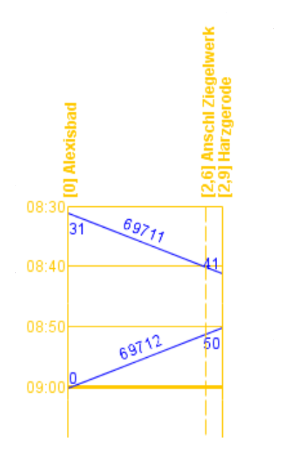
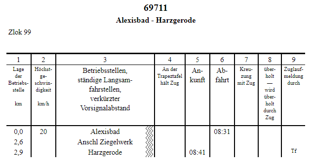

FPLedit ist ein kostenloses Programm zum Erstellen von Fahrplänen. Dies ist vorallem für **betriebsorientierte Modellbahner** interessant, die auf ihrer Anlage einen vorbildgetreuen Betrieb durchführen wollen und dafür **ans Original angelehnte Fahrplanunterlagen** verwenden wollen. Die Vorlagen dafür werden in der Regel bei der DB bzw. DR gesucht. FPLedit ist dabei aber nicht so komplex (und teuer) wie andere, professionelle Fahrplansoftware für "echte" Verkehrsbetriebe.


Die zweite Hauptversion von FPLedit wurde veröffentlicht! Das wichtigste neue Feature ist sicherlich die Unterstützung von Netzwerk-Strecken. Aber auch alte, nun als linear bezeichnete Fahrplan-Dateien sind weiterhhin mit FPLedit kompatibel. Trotzdem gibt es einige Stellen, an denen sich FPLedit 2.0.0 von Version 1.5.2 unterscheidet. An manchen Stellen ist die Bedienung komplexer geworden, aber hoffentlich insgesamt intuitiver.

Die Kompatibilität von Netzwerk-Fahrplänen mit **jTrainGraph** ist nicht so gut wie bei FPLedit 1.5.4: Die Fahrplandateien nutzen zwar noch das gleiche, aber funktional stark erweiterte Dateiformat, welches dadurch von jTrainGraph derzeit nicht gelesen werden kann. Der jTrainGraph-Starter ist natürlich weiterhin vorhanden und erlaubt auch bei dem neuen Format das Erstellen von Bildfahrplänen und das Anpassen der zugehörigen Einstellungen. Das Ändern des Fahrplans in jTrainGraph selbst ist aber (derzeit) nicht mehr möglich.



jTraingGrpah 3.0 ist bis einschließlich Version leider 3.02 nicht mit FPLedit kompatibel. Die Versionen 2.02 und 2.03 können problemlos weiter eingesetzt werden. jTrainGraph Version 3.03 ist leider noch nicht veröffentlicht.


## Features
- [Erstellen und Bearbeiten](/fahrplaene-bearbeiten/) von Fahrplänen bestehend aus einer einzelnen Strecke oder einem Streckennetz und den darauf verkehrenden Zügen.

- Generieren von unterschiedlichen Fahrplantypen, z.B. **Buchfahrplänen** oder **Aushangfahrplänen** und anschließender Export in von FPLedit unabhängige Dateiformate (HTML).

- Kompatibilität mit dem bekannten Bildfahrplanprogramm [jTrainGraph](https://jtraingraph.de/). Dateien, die mit einer jTrainGraph-Programmversion größer oder gleich 2.02 erstellt worden sind, können mit FPLedit geöffnet werden (und anschließend auch wieder mit jTrainGraph). Das Generieren von **Bildfahrplänen** ist somit möglich. (**ACHTUNG**: Seit Version 2.0.0 ist dies eingeschränkt, siehe Meldung oben)
<!-- - Kompatibilität mit der FREMO-Software XPLN -->

- Weiterentwicklung: FPLedit wird weiterentwickelt und wird in Zukunft noch einige Features und andere Fahrplanformate erhalten.

- Möglichkeit der Erweiterung durch [selbst erstellte Extensions](/dev/), geschrieben in der Programmiersprache C#.

## Fahrplan-Ausgabeformate

Bei den deutschen Eisenbahnen waren und sind verschiedene Fahrplan-Formate im Einsatz. Diese Seite soll als Entscheidungshilfe dienen, welcher Fahrplantyp zum Einsatz kommen soll.

| Bildfahrpläne                                 | Buchfahrpläne                             | Aushangfahrpläne                               |
|-----------------------------------------------|-------------------------------------------|------------------------------------------------|
| Enthält alle Züge einer Strecke               | Enthält nur einen Zug                     | Enthält alle Züge, die an einem Bahnhof halten |
|                  |               |                 |
| [Erstellung mit jTrainGraph](/bildfahrplaene) | [Erstellung mit FPLedit](/buchfahrplaene) | [Erstellung mit FPLedit](/aushangfahrplaene)   |

Das Dateiformat von FPLedit und jTrainGraph ist vollständig kompatibel. Somit können alle drei Formate aus der gleichen Datei generiert werden. Ob das Anlegen der Daten mit jTrainGraph oder FPLedit erfolgt, ist dabei egal. Die erweiterte Konfiguration der Ausgabe ist aber nur mit dem entsprechenden Programm möglich. **Netzwerk-Fahrpläne** können nur noch mit FPLedit erstellt werden (siehe auch Hinweis oben).

## Systemvoraussetzungen
FPLedit läuft auf allen Systemen, auf denen entweder Microsoft .NET ab Version 4.5 (installierbar ab Windows Vista) oder ein aktuelles [Mono](http://www.mono-project.com/) installiert ist. Damit sollte dieses Programm auf **Windows und [Linux](/download/linux/)** laufen.

## Danke!
Vielen Dank an alle, die dieses Programm verwenden: Ohne euch wäre die Arbeit hier nutzlos. Und auch ein noch größeres Dankeschön an alle die, die bei der Behebung von Fehlern und dem Testen von neuen Funktionen helfen und Ideen für neue Funktionen beisteuern! Natürlich auch ein Danke an Moritz Scherzinger von jTrainGraph für die gute Kooperation beim gemeinsam verwendeten Dateiformat!

{}
