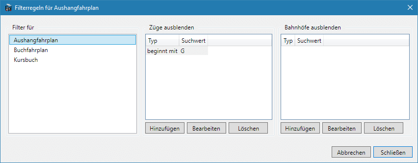

Seit Version 1.4.0 können Aushangfahrpläne generiert werden. Die entsprechende Erweiterung muss natürlich aktiviert sein.

Um den Aushangfahrplan als Vorschau anzuzeigen, verwenden Sie `Vorschau > Aushangfahrplan`. Unter `Bearbeiten > Filterregeln` können Regeln angelegt werden, nach denen vor der Ausgabe die Züge und Bahnhöfe gefiltert werden. Damit könnten z.B. alle Güterzüge und Anschlussstellen aus dem Aushangfahrplan ausgeblendet werden.

## Anpassen von Aushangfahrplänen
Unter `Bearbeiten > Fahrplandarstellung` im Reiter `Aushangfahrplan` kann das Aussehen des Aushangfahrplans beeinflusst werden. Die Auswahlmöglichkeit einer Vorlage erlaubt es, die Darstellung des Aushangfahrplans schnell an verschiedene Gegebenheiten anzupassen.

Die Schriftart, die für die Fahrplan-Darstellung verwendet wird, kann aus allen auf dem System installierten Schriftarten ausgewählt werden. Danaben können noch besondere Werte wie z.B. `serif`, `sans-serif` verwendet werden.

Es kann weiterhin ausgewählt werden, ob Gleisangaben im Aushangfahrplan angzeigt werden sollen. Die Gleisangaben werden in der folgenden Reihenfolge ermittelt: Abfahrtsgleis des Zugs > Ankunftsgleis des Zugs > Standardgleis des Bahnhofs in die Richtung des Zuges.

Weiterführend kann die Plandarstellung mit CSS (= Cascading Style Sheets) angepasst werden, da er ja im HTML-Format exportiert wird. Mit CSS können nahezu alle Aspekte der Plandarstellung geändert werden. Zur Aktivierung und Verwendung von CSS gibt es auf [dieser Unterseite](/dev/css/) aber eine ausführlichere Anleitung.

Der Aushangfahrplan folgt grob einer Vorlage vom Bahnhof Malsch aus der Zeit der DRG. Die Darstellung ist weit nicht so vorbildnah wie bei den anderen Formaten:

## Aushangfahrpläne exportieren und drucken
Aushangfahrpläne können mit `Datei > Export` als HTML-Datei exportiert werden. Zum Anzeigen dieser Datei wird ein Webbrowser (wie z.B. Firefox) benötigt. Zur Ansicht der HTML-Fahrpläne müssen auch die ausgewählten Schriftarten auf dem Computer installiert sein, eine einfache Weitergabe ist deshalb nicht möglich.

Ein direktes Drucken aus FPLedit heraus ist nicht möglich. Aber aus dem Webbrowser heraus können die als HTML exportierten Fahrpläne gedruckt werden. Die im Browser angegebenen Druckränder werden ignoriert.

Mit einem PDF-Drucker (wie z.B. PDF24) lassen sich so auch die exportierten Fahrpläne in eine PDF-Datei umwandeln und damit auch ohne Installation der für den Fahrplan ausgewählten Schriften auf anderen Computern ansehen. Auch können viele PDF-Reader zwei A5-Seiten zusammen auf eine A4-Seite drucken, dann hat man die richtige Größe, wenn man die A4-Seite in der Mitte auseinanderschneidet bzw. faltet.

{}