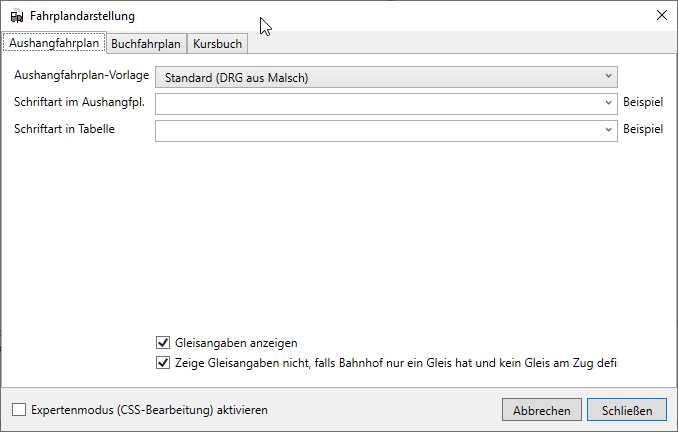

Aushangfahrpläne sind Fahrpläne, die den Reisenden die Abfahrtszeiten am jeweiligen Bahnhof anzeigen und damit wahrscheinlich die den Reisenden am häufigsten sichtabren Fahrpläne. Sie enthalten daher in der Regel nicht so viele Informationen, wie andere betriebsinterne Fahrplanformate, sondern nur für Reisende relevante Daten: Abfahrts- und manchmal an größeren Bahnhöfen auch Ankunftszeiten, Gleisangaben, Zielbahnhöfe.

Der Aushangfahrplan, der mit der Standard-Vorlage von FPledit erstellt wird, folgt grob einer Vorlage vom Bahnhof Malsch aus der Zeit der DRG und enthält keine Ankunftszeiten. Damit ist er am besten für kleinere Bahnhöfe an einer oder wenigen Strecken zu verwenden:

Um den Aushangfahrplan als Vorschau anzuzeigen, verwenden Sie `Vorschau > Aushangfahrplan`. Unter `Bearbeiten > Filterregeln` können Regeln angelegt werden, nach denen vor der Ausgabe die Züge und Bahnhöfe gefiltert werden. Damit könnten z.B. alle Güterzüge und Anschlussstellen aus dem Aushangfahrplan ausgeblendet werden.

## Anpassen von Aushangfahrplänen
Unter `Bearbeiten > Fahrplandarstellung` im Reiter `Aushangfahrplan` kann das Aussehen des Aushangfahrplans beeinflusst werden. Die Auswahlmöglichkeit einer Vorlage erlaubt es, die Darstellung des Aushangfahrplans schnell an verschiedene Gegebenheiten anzupassen.

Die Schriftart, die für die Fahrplan-Darstellung verwendet wird, kann aus allen auf dem System installierten Schriftarten ausgewählt werden. Danaben können noch besondere Werte wie z.B. `serif`, `sans-serif` verwendet werden.

Es kann weiterhin ausgewählt werden, ob Gleisangaben im Aushangfahrplan angzeigt werden sollen. Die Gleisangaben werden in der folgenden Reihenfolge ermittelt: Abfahrtsgleis des Zugs > Ankunftsgleis des Zugs > Standardgleis des Bahnhofs in die Richtung des Zuges.

Weiterführend kann die Plandarstellung mit CSS (= Cascading Style Sheets) angepasst werden, da er ja im HTML-Format exportiert wird. Mit CSS können nahezu alle Aspekte der Plandarstellung geändert werden. Zur Aktivierung und Verwendung von CSS gibt es auf [dieser Unterseite](/dev/css/) aber eine ausführlichere Anleitung.

## Aushangfahrpläne exportieren und drucken


{}