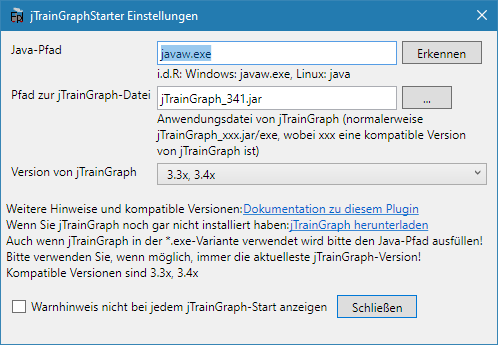

Ein direktes Erstellen von Bildfahrplänen ist mit FPLedit nicht (mehr) möglich. Bitte nutzen Sie stattdessen [jTrainGraph](https://jtraingraph.de/), dessen Dateiformat kompatibel mit FPLedit ist. jTrainGraph bietet mehr Einstellungsmöglichkeiten als FPLedit und ist ebenso wie FPLedit auf mehreren Plattformen lauffähig. Dazu benötigt es aber eine auf dem System installierte Java-Laufzeitumgebung.

**WICHTIG**: [jTrainGraph](https://jtraingraph.de/) muss in in einer kompatiblen Version auf dem PC vorhanden/installiert sein, andere Versionen sind nicht kompatibel! FPLedit stellt dabei nur den Starter zur Verfügung, jTrainGraph ist ein eigenständiges Programm. Informationen zur Kompatibilität finden Sie am Ende dieser Seite.

**Hinweis**: Bevor diese Funktion genutzt werden kann, muss sie zuerst [konfiguriert](#konfiguration) werden.


Bei der Verwendung von Netzwerk-Fahrplänen mit jTrainGrapph können keine Fahrplanänderungen aus jTrainGraph übernommen werden!


## Lineare Fahrpläne

Um jTrainGraph direkt aus FPLedit zu starten, benutzen Sie `jTrainGraph > jTrainGraph starten`. Dies speichert automatisch die aktuelle Datei und öffnet diese dann in jTrainGraph. Um die dort geänderten Daten wieder zurückzuübernehmen speichern Sie die Datei in jTrainGraph und schließen anschließend das Fenster. Die geänderten Daten werden wieder geladen.

**Achtung:** Die Datei wird am aktuellen Speicherort gespeichert, dabei werden alle Änderungen in die Datei geschrieben und können nicht mehr durch Schließen von FPLedit verworfen werden!

## Netzwerk-Fahrpläne

Um jTrainGraph direkt aus FPLedit zu starten, benutzen Sie `jTrainGraph > jTrainGraph starten (aktuelle Route)`. Diese Aktion ist **streckengebunden**. Dies speichert die aktuell ausgewählte Route in eine temporäre Datei und öffnet dann jTrainGraph. Um die dort geänderten Daten wieder zurückzuübernehmen speichern Sie die Datei in jTrainGraph und schließen anschließend das jTrainGraph-Fenster. Die Änderungen an den Bildfahrplaneinstellungen werden wieder geladen.

**Achtung**: Es werden nur Änderungen an der Bildfahrplandarstellung übernommen, alle anderen Änderungen (z.B. Bahnhöfe oder Züge einfügen) werden verworfen!

## Konfiguration
Die Einstellungen befinden sich unter `jTrainGraph > Einstellungen`. Der java-Pfad ist der Pfad zur Programmdatei von Java. Unter Windows sollte dieser normalerweise `javaw.exe` (bzw. `java` unter Linux) lauten. In manchen Fällen muss aber auch der absolute Pfad angegeben werden. Es kann auch der `Erkennen`-Button genutzt werden, um auf Windows automatisch den Java-Pfad herauszufinden.

Der Pfad zur jTrainGraph-Datei lautet bei Installation im gleichen Verzeichnis `jTrainGraph_341.jar` (341 durch die jeweils aktuelle Version ersetzen). Ebenfalls muss der Pfad hier angepasst werden, wenn die Installation nicht im gleichen Verzeichnis erfolgt ist.

Weiter muss ausgewählt werden, welche Version von jTrainGraph verwendet wird. Damit wird die Zielversion von jTrainGraph entsprechend verwendet.

In den neuesten Versionen bietet jTrainGraph eine exe-Version an. Bei der Konfiguration muss gleich verfahren werden, sowohl der java-Pfad als auch der Pfad zur jTrainGraph-(exe)-Datei muss angegeben werden.

Wenn die Konfiguration nicht korrekt erfolgt ist, warnt das Programm sowohl beim Speichern der Einstellungen als auch beim Versuch, jTrainGraph über das Menü zu starten.

## Kompatibilitätsmatrix
| FPLedit Version | ist kompatibel mit | jTrainGraph Versionen       |
|-----------------|--------------------|-----------------------------|
| < 1.5.4         | &rarr;             | 2.02, 2.03                  |
| 1.5.4           | &rarr;             | 2.02, 2.03, 3.03            |
| 2.0.0           | &rarr;             | 2.02, 2.03, 3.03            |
| 2.1.x, 2.2.x    | &rarr;             | 2.02, 2.03, 3.03, 3.11      |
| 2.3.x           | &rarr;             | 3.11, 3.2x, 3.3x            |
| 2.4.x           | &rarr;             | 3.3x, 3.4x (ab 2.4.2)       |

{}
