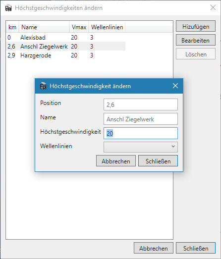
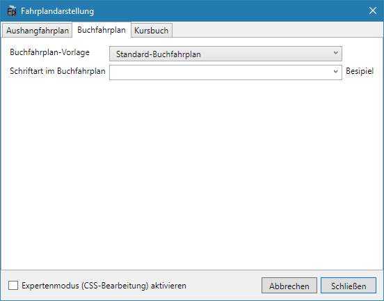

Zur Zeit wird kein vollständiger Buchfahrplan generiert, an einigen Stellen ist dieser vereinfacht. Das Modul wird aber in den nächsten Versionen noch einige Verbesserungen und Features erhalten.

Dieser Buchfahrplan ist zwar schon recht nah am Vorbild, es fehlt aber trotzdem noch einiges bzw. das Format ist stark vereinfacht:

Um den Buchfahrplan als Vorschau anzuzeigen, verwenden Sie `Vorschau > Buchfahrplan`.

## Hinzufügen von Höchstgeschwindigkeiten

Daneben kann für die einzelnen Bahnhöfe auf der Strecke eine Höchstgeschwindigkeit definieren. Diese Aktion ist **streckengebunden**, das heißt es muss vorher die entsprechende Strecke ausgewählt und rot markiert sein. Anschließend kann mit einem Klick auf den Button `Höchstgeschwindigkeiten ändern` das entsprechende Fenster geöffnet werden.

Neue Geschwindigkeitswechsel (ohne Bahnhof und Fahrtzeiten) auf der freien Strecke können über die Schaltfläche `Hinzufügen` angelegt werden.

* Geschwindigkeit, die ab dem Punkt gilt.
* Neben der Station anzuzeigende Wellenlinien (Symbol für Streckensteigungen): 1 Wellenlinie >= 10 ‰, 2 Wellenlinien >= 20 ‰ usw. Diese werden im Buchfahrplan, wenn auch möglicherweise nicht in allen Vorlagen, angezeigt.
* Streckenrichtung, in der der Wechsel gilt. Ein Wechsel kann entweder in beiden Richtungen, oder nur in oder geegn die Richtung der Kilometrierung gelten.

Bei Geschwindigkeitswechseln können alle Eigenschaften bearbeitet werden, bei Bahnhöfen nur die Geschwindigkeit. Die Position und anderen Eigenschaften der Bahnhöfe können im Netz- oder Streckeneditor bearbeitet werden.

In den Namen der Geschwindigkeitswechsel können Sonderzeichen verwendet werden, die in Buchfahrplänen eine besondere Bedeutung haben. Zum Verwenden im Plan bitte hier in der Dokumentation Kopieren () und im Namenstextfeld einfügen ().



Unter `Bearbeiten > Filterregeln` können Regeln angelegt werden, nach denen vor der Ausgabe die Züge und Bahnhöfe gefiltert werden. Damit könnten z.B. alle Güterzüge oder Anschlussstellen aus dem Buchfahrplan ausgeblendet werden.

## Anpassen von Buchfahrplänen
Unter `Bearbeiten > Fahrplandarstellung` im Reiter `Buchfahrplan` kann das Aussehen des Buchfahrplans beeinflusst werden. Die Auswahlmöglichkeit einer Vorlage erlaubt es, die Darstellung des Buchfahrplans schnell an verschiedene Gegebenheiten anzupassen.

Die Schriftart, die für die Fahrplan-Darstellung verwendet wird, kann aus allen auf dem System installierten Schriftarten ausgewählt werden. Daneben können noch besondere Werte wie z.B. `serif`, `sans-serif` verwendet werden.

Es kann außerdem ausgewählt werden, ob der beim Zug eingegebene Kommentar und/oder die Verkehrstage des Zuges angezeigt werden sollen.

Weiterführend kann die Plandarstellung mit CSS (= Cascading Style Sheets) angepasst werden, da er ja im HTML-Format exportiert wird. Mit CSS können nahezu alle Aspekte der Plandarstellung geändert werden. Zur Aktivierung und Verwendung von CSS gibt es auf [dieser Unterseite](/dev/css/) aber eine ausführlichere Anleitung.

## Buchfahrpläne exportieren und drucken


Die Druckaugabe ist für die Papiergröße A5 optimiert (Format der Vorbild-Buchfahrpläne). Die im Browser angegebenen Druckränder werden ignoriert. Speichert man den Fahrplan als PDF-Datei, so ist es nützlich, dass viele PDF-Reader zwei A5-Seiten zusammen auf eine A4-Seite drucken können – dann hat man die richtige Größe, wenn man die A4-Seite in der Mitte auseinanderschneidet bzw. faltet.

{}
