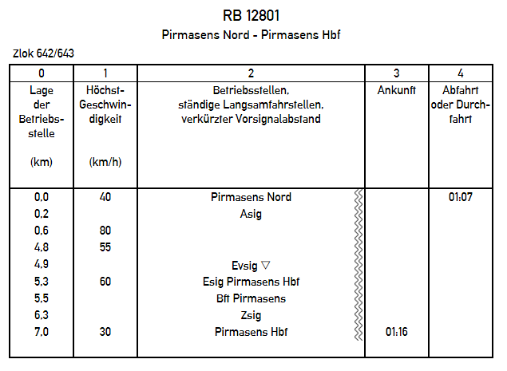
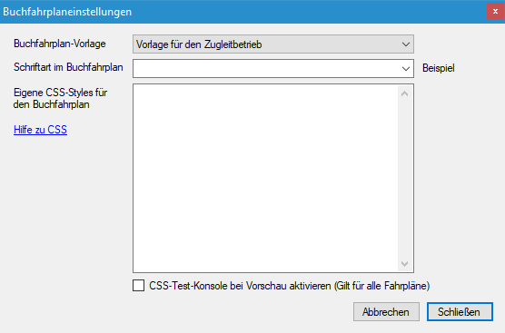

Der ursprüngliche Zweck von FPLedit war die Erstellung von Buchfahrplänen. Die entsprechende Erweiterung muss natürlich aktiviert sein. Zur Zeit wird kein vollständiger Buchfahrplan generiert, an einigen Stellen ist dieser vereinfacht. Das Modul wird aber in den nächsten Versionen noch einige Verbesserungen und Features erhalten.

Um den Buchfahrplan als Vorschau anzuzeigen, verwenden Sie `Buchfahrplan > Anzeigen`. Daneben können über den Menüpunkt `Buchfahrplan > Höchstgeschwindigkeiten ändern` für die einzelenen Bahnhöfe auf der Strecke eine Höchstgeschwindigkeit definieren. Neue Geschwindigkeitswechsel (ohne Bahnhof und Fahrtzeiten) auf der freien Strecke können über die Schaltfläche `Hinzufügen` angelegt werden.

Daneben können noch die neben einer Station anzuzeigenden Wellenlinien ausgwählt werden. 1 Wellenlinie >= 10 ‰, 2 Wellenlinien >= 20 ‰ usw. Diese werden im Buchfahrplan, wenn auch möglicherweise nicht in allen Vorlagen, angezeigt.

Bei Geschwindigkeitswechseln können alle Eigenschaften bearbeitet werden, bei Bahnhöfen nur die Geschwindigkeit. Die anderen Eigenschaften der Bahnhöfe können unter `Bearbeiten > Strecke bearbeiten` bearbeitet werden.

In den Namen der Geschwindigkeitswechsel können Sonderzeichen verwendet werden, die in Buchfahrplänen eine besondere Bedeutung haben. Zum Verwenden im Plan bitte hier Kopieren (<kbd>Strg+C</kbd>) und im Namenstextfeld einfügen (<kbd>Strg+V</kbd>).

| Symbol | Bedeutung                               |
|--------|-----------------------------------------|
| ¥      | Ende des anschließenden Weichenbereichs |
| ▽      | Verkürzter Vorsignalabstand             |
| ┣━╸    | Einfahrt in Stumpfgleis                 |

Dieser Buchfahrplan (generiert mit v1.3.0) ist zwar schon recht nah am Vorbild, es fehlt aber trotzdem noch einiges bzw. das Format ist stark vereinfacht:

## Anpassen von Buchfahrplänen
Unter `Buchfahrplan > Buchfahrplaneinstellungen` kann das Aussehen des Buchfahrplans beeinflusst werden. Die Auswahlmöglichkeit einer Vorlage erlaubt es, die Darstellung des Buchfahrplans schnell an verschiedene Gegebenheiten anzupassen. Eine Erweiterbarkeit ist für die Zukunft vorgesehen.

Die Schriftart, die für die Fahrplan-Darstellung verwendet wird, kann aus allen auf dem System installierten Schriftarten ausgewählt werden. Danaben können noch besondere Werte wie z.B. `serif`, `sans-serif` verwendet werden.

Weiterführend kann die Plandarstellung mit CSS (= Cascading Style Sheets) angepasst werden, da er ja im HTML-Format exportiert wird. Mit CSS können nahezu alle Aspkete der Plandarstellung geändert werden. Zu CSS gibt es auf [dieser Unterseite](css/) aber eine ausführlichere Anleitung.

## Buchfahrpläne exportieren und drucken
Buchfahrpläne können mit `Datei > Export` als HTML-Datei exportiert werden. Zum Anzeigen dieser Datei wird ein Webbrowser (z.B. Firefox) benötigt. Zur Ansicht der HTML-Fahrpläne müssen auch die ausgewählten Schriftarten auf dem Computer installiert sein, eine einfache Weitergabe ist deshalb nicht möglich.

Ein direktes Drucken aus FPLedit heraus ist nicht möglich. Aber aus dem Webbrowser heraus können die als HTML exportierten Fahrpläne gedruckt werden. Die Druckaugabe ist für die Papiergröße A5 optimiert (Format der Vorbild-Buchfahrpläne). Die im Browser angegebenen Druckränder werden ignoriert.

Mit einem PDF-Drucker (z.B. PDF24) lassen sich so auch die exportierten Fahrpläne in eine PDF-Datei umwandeln und damit auch ohne Installation der für den Fahrplan ausgewählten Schriften auf anderen Computern ansehen. Auch können viele PDF-Reader zwei A5-Seiten zusammen auf eine A4-Seite drucken, dann hat man die richtige Größe, wenn man die A4-Seite in der Mitte auseinanderschneidet bzw. faltet.

{}
