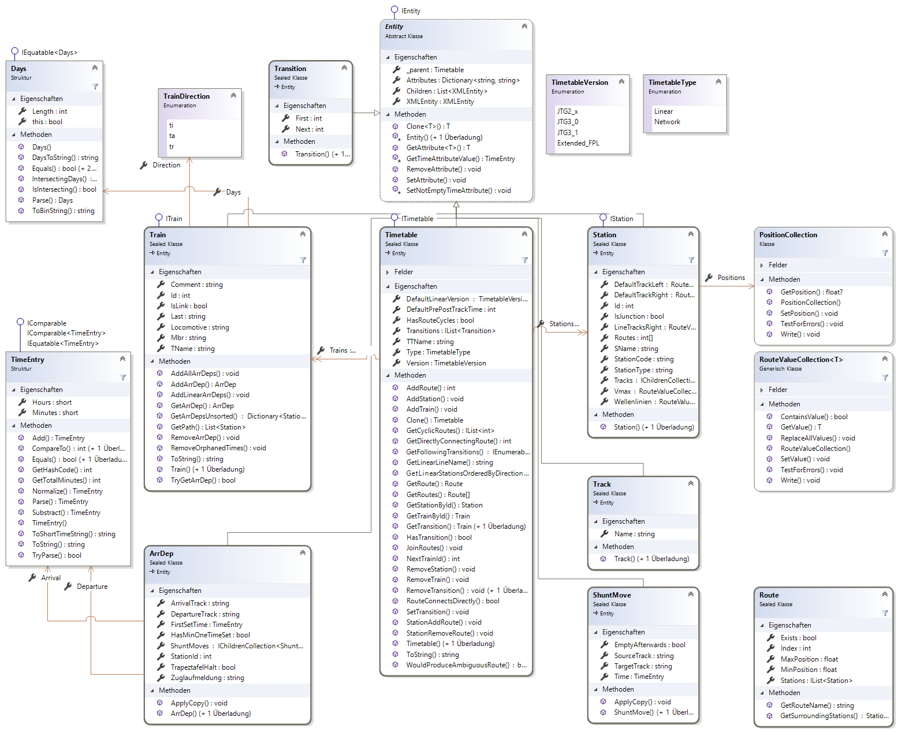


Zur Entwicklung von Erweiterung sind Programmierkenntnisse erforderlich. Wenn Sie Ideen oder Anregungen haben und nicht gleich eine eigene Erweiterung entwickeln wollen, können Sie sich auch gerne per Mail (Adresse siehe Impressum) bei mir melden.

Die hier beschriebenen Konzepte werden für den gewöhlichen Gebrauch von FPLedit nicht benötigt!



Die API-Dokumentation befindet sich unter https://apidoc.fpledit.de/ (in Englischer Sprache). Diese Anleitung führt nur in die wichtigesten Konzepte ein. In Zukunft wird der Entwickler-Bereich dieser Hauptseite auch auf die neue Seite verschoben.


> **Achtung**: Diese Anleitung ist zur Zeit auf dem Stand von FPLedit Version 2.2.0. Möglicherweise ist sie nicht 100%ig aktuell. In zukünftigen Versionen werden möglicherweise die Programmschnittstellen geändert. Die [API-Dokumentation](https://apidoc.fpledit.de/) ist in der Regel aktueller.

FPLedit basiert auf .NET und ist in der Programmiersprache C# geschrieben, daher ist dies auch die am besten für die Erweiterungsentwicklung geeignete Sprache. Zur Entwicklung mit C# ist die kostenlose Entwicklungsumgebung [Visual Studio Community](https://www.visualstudio.com/de/) von Microsoft gut geeignet, aber auch Alternativen (z.B. das (kostenlose) Visual Studio Code und (kostenpflichtige) Rider für Linux) sind verwendbar.

Alle Erweiterungen müssen einen Verweis auf die Assembly `FPLedit.Shared.dll` enthalten. Alle im Folgenden verwendeten Typen stammen aus dieser Assembly. Im Regelfall sollten diese Typen ausreichen, um eine FPLedit-Erweiterung zu erstellen. Die anderen Erweiterungen stellen in der Regel keine öffentliche API bereit. Ausnahmen sind:

* `FPLedit.Shared.UI.dll` zur Bereitstellung von gemeinsam genutzten UI-Controls.
* `FPLedit.Shared.Rendering.dll` zur Bereitstellung von gemeinsamen Hilfsklassen zur Bildschirmdarstellung (insbesondere zum Zeichnen).

Der Code aus diesen Beispielen findet sich auf GitHub: [FPLedit-TestPlugin](https://github.com/ManuelHu/FPLedit-TestPlugin). Der dort verwendete Code darf gerne als Basis für eigene Erweiterungen verwendet werden.

## Vorlagen
Die wohl wichtigste und auch gleichzeitig einfachste Möglichkeit, FPLedit zu erweitern sind eigene Vorlagen ("Templates"). Eigene Vorlagen werden seit FPLedit 2.0.0 als Textdateien im Programmverzeichnis gespeichert, können aber auch in Erweiterungen einkompiliert werden. Zum Entwickeln von Vorlagen gibt es daher eine eigene [Unterseite](templates/). Der folgende Abschnitt über das Dateiformat ist aber auch für die Vorlagenentwicklung wichtig:

## Dateiformat
Bevor es hier an die Entwicklung einer eigenen Erweiterung geht, möchte ich hier kurz das von FPLedit verwendete Dateiformat bzw. seine Repräsentation als Objektmodell beschreiben. Jedes Objekt ist einem entsprechenden XML-Element zugeordnet. Daher haben alle von `Entity` erbenden Klassen `Attributes` (=> XML-Attribute) und `Children` (=> XML-Kindelemente).



Das Dateiformat bleibt dabei immer recht nahe am XML-Format und folgt dem jTrainGraph-Dateiformat.

### Einige Kernelemente:

* Die zentrale Klasse ist der `Timetable` der einen konsistenten Zustand der Fahrplandatei darstellt. Dieses Objekt wird aus der Fahrplandatei geladen und beim Speichern wieder zurückgeschrieben.
* Ein `Timetable.Type` kann als Typangabe eine der beiden Werte annehmen:
    * `TimetableType.Network` als Netzwerk-Fahrplan
    * `TimetableType.Linear` als lineare Strecke.
* Drei zentrale Elemente existieren in einer Fahrplandatei:
    * Stationen (Eine andere Bezeichnung wären Betriebsstellen) sind Punkte an den Strecken, an denen Züge beginnen, enden, oder halten können, auf eine andere Strecke übergehen, etc. Reine Geschwindigkeitswechsel können, müssen aber nicht mit Stationen gelöst werden.
    * Strecken fassen eine oder mehrere Stationen zu einem Verbund zusammen. In netzwerk-Fahrplänen kann mehr als eine Strecke existieren, in linearen Fahrplänen existiert nur die Strecke mit der ID 0, die alle Stationen enthält.
    * Züge verkehren über eine Strecke (linear) oder über mehrere Stationen (Netzwerk) hinweg.
* Jedes Element (erbt von der Klasse `Entity`) einer Datei kann weitere *Attribute* besitzen, die in XML gespeichert werden. Jede Entity hat eine zugehörige `XMLEntity`, die Daten in der XML-Baumstruktur hält. Damit diese Zuordnung immer funktioniert und bestehen bleibt, sollten nur die bereitsgestellten High-Level-APIs verwendet werden - es sei denn, man implementiert eigene `Entity`-Klassen.

## Die Hauptklasse des Plugins definieren
Die Hauptklasse eines Plugins, in der Regel heißt diese `Plugin`, muss zwingend die Schnittstelle `FPLedit.Shared.IPlugin` implementieren. Damit muss auch zwingend eine Methode `Init` vorhanden sein. Weiterhin muss die Klasse auch ein Attribut in der Form `[Plugin("name", "minVer", "maxVer")]` aufweisen, damit die Erweiterung von FPLedit erkannt wird. `minVer` ist dabei die minimale Version von FPLedit, mit der das Plugin kompatibel ist und `maxVer` der Versionszweig, der maximal (wahrscheinlich) kompatibel ist. Beispiel: `2.2` als maximale Version und `2.2.0` als minimale Version erlaubt die Verwendung der Erweiterung mit dem Versionszweig `2.2.*`. Ein einfaches Plugin sieht dann so aus:

```csharp
using FPLedit.Shared;

namespace TestPlugin
{
    [Plugin("TestPlugin", "2.2.0", "2.2", Author = "Autorenname")]
    public class Plugin : IPlugin
    {
        public void Init(IPluginInterface info)
        {
            // Code zur Initialisierung der Erweiterung
        }
    }
}
```

Die Autorenangabe kann auch weggelassen werden: `[Plugin("TestPlugin", "2.2.0", "2.2")]`. Diese wird im Erweiterungsfenster angezeigt. Jede so definierte Plugin-Klasse kann einzeln über die Benutzeroberfläche (de-)aktiviert werden.

Die Init-Methode wird beim Programmstart aufgerufen und sollte deshalb wenn möglich keine langen Operationen ausführen. Noch nicht alle Funktionen des Programms stehen zu diesem Zeitpunkt bereits bereit.

## Das `IPluginInterface`-Objekt
Das an die `Init`-Methode des Plugins übergebene `IPluginInterface`-Objekt enthält alle Funktionen, mit denen FPLedit angepasst werden kann. Einige dieser Möglichkeiten werden im Folgenden beschrieben:


### Allgemein: Log-Ausgaben
Das `IInfo`-Objekt enthält einen `Logger`. Darüber können Meldungen in das Textfenster des Hauptprogramms ausgegeben werden:

```csharp
info.Logger.Info("Das ist nur eine Meldung");
info.Logger.Warning("Die Warnmeldung ist auf Windows-Systemen gelb");
info.Logger.Error("Fehlermeldungen sind rot");
info.Logger.Debug("Debug-Meldungen werden dem Benutzer nicht angezeigt");
```

Je nach Konfiguration werden diese Daten nicht nur im Hauptfenster angezeigt, sondern auch in eine Log-Datei im Temp-Verzeichnis geschrieben.

### Allgemein: Einstellungen
Die Anwendugnseinstellungen werden in einer Einstellungsdatei gespeichert, zum Zugriff darauf stehen eigene APIs bereit. Einzelne Erweiterungen müssen sich daher nicht um die dahinter stehenden Details kümmern, sondern können die Abstraktion `info.Settings` verwenden.

```csharp
// Wert ermitteln:
bool a = info.Settings.Get<bool>("test-bool", false);
// Wert setzen:
info.Settings.Set("test-bool", true);
// Werte ändern sich nicht, sondern müssen neu abgefragt werden:
bool b = info.Settings.Get<bool>("test-bool", false);
info.Logger.Info("a == b: " + (a == b));
// Sie lassen sich auch wieder entfernen:
info.Settings.Remove("test-bool");

/*
* Hinweis: Im IReducedPluginInterface können Einstellungen nur gelesen werden.
*/
```

### Erweiterungen der Benutzeroberfläche (Register: verschiedene)

An unterschiedlichen Stellen können sich Erweiterungen in die vorhandene Benutzerschnittstelle einklinken. Die entsprechenden Schnittstellen sind in der Regel einfach aufgebaut und bestehen (meist) nur aus einem Anzeigenamen und einer Aktion die Ausgeführt wird. Ggf. kann auch noch angegeben werden, wann das entsprechenden Element aktiviert sein soll. Alle diese Komponeneten müssen jeweils registriert werden.

* Eigene Menüelemente im `Bearbeiten`-Menü: `IEditMenuItemProxy`
* Eigene Seite unter `Bearbeiten > Fahrplandarstellung`: `IAppearanceControl`, welches ein eigenes Eto-Control zurückgibt. Dieses muss `IAppearanceHandler` implementieren, um auf AKtionen des Nutzers zu reagieren.
* Eigenes Menüelement unter `Vorschau`: `IPreviewAction`. `MenuName` kann hier das Zeichen **&** enthalten, um das Menü mit der Tastatur zugänglich zu machen.
* Eigene Schaltfläche in der Menüleiste des Netzwerkeditors: `IRouteAction`, ist von der aktuell ausgewählten Strecke abhängig.
* `ITimetableCheck`: Anzeige von Warnungen, falls Fahrplandatei "inkonsistent" ist (das kann durch die Erweiterung definiert werden). Wird bei jeder Änderung der Datei aufgerufen. Dje Aktion ist asynchron und bekommt nur eine Kopie des Fahrplans übergeben.
* `ITimetableInitAction`: Aktion, die einmalig beim (erneuten) Öffnen jeder Datei ausgeführt wird.
* `ITimetableTypeChangeAction`: Aktion, die beim Ändern des Fahrplantyps (Netzwerk auf Linear oder umgekehrt) aufgerufen wird.

### Standardimplementierungen häufiger Funktionen - Templating (Register: verschiedene)
Einige in den Standard-Erweiterungen häufig verwendete Funktionen sind als Standardimplementierung verfügbar und können auch von eigenen Erweiterungen verwendet werden. Besonders Funktionalität in Verbindung mit dem Template-System ist hier zu finden.

Eine Erweiterung kann einen eigenen Template-Typ defineren. Dazu muss eine eindeutige, kurze, nur aus Buchstaben bestehende Abkürzung gewählt werden. Hier als Beispiel `xyfplext` (`bfpl`, `kfpl`, `afpl` sind bereits definiert). Eine [Vorlage](templates/), die diesen Typ angibt, steht der Erweiteurng zur Vefügung. Die Logik dahinter muss nicht neu implementiert werden: `DefaultTemplateChooser` stellt dafür ein einheitliches Kosntrukt bereit. Hierzu müssen Template-`type`, XML-`elemName` bzw -`attrName` angegeben werden - letztere adressieren das XML-Attribut, in dem die Auswahl gespeichert wird. Das `defaultTemplate` ist dabei ein kompletter Template-Name.

Der `DefaultTemplateExport` exportiert ein Template mit Fahrplandaten als Textdatei. Hier muss als Closure eine Funktion übergeben werden, die den TemplateChooser zurückgibt, und der Dateityp als Filter (siehe Kapitel "Export"). Diese Klasse kümmert sich um den Rest.

Die `DefaultPreview` kann verwendet werden, um generierte HTML-Dateien an einen temporären Ort zu speichern und dann im Broswer zu öffnen. Hier wird der Template-`type`, ein Anzeigename und der entsprechende Exporter benötigt.

Das `DefaultAppearanceControl` ist schließlich eine Möglichkeit, ein `IAppearanceControl` zu injizieren, ohne füür diese geringe Funktionalität eine eigene Klasse erzeugen zu müssen.

`DefaultFilterRuleContainer` kann die Defintion von Filter-Patterns vereinfachen vereinfachen. Dokumentation hierzu muss noch geschrieben werden <!-- TODO -->

Alle für die Verwendeung in Templates vorgesehenen Klassen müssen mit dem Attribut `[TemplateSafe]` markiert werden.

### Exporter (Register: IExport)
Exporter waren ursprünglich das zentrale erweiterbarre Feature von FPLedit. Mittlerweile können für die häufig verwendeten HTML-Exporte auf Standardimplementierungen (siehe oben) zurückgegriffen werden.

Ein Exporter erzeugt Dateien eines beliebigen Dateityps aus den vorhandenen Fahrplandaten. Exporter implementieren immer die Schnittstelle `IExport`. Der `Filter` gibt an, welcher Dateityp vom Exportr unterstützt wird; er sollte im Format `Beschreibung (*.Endung)|*.Endung` sein.

```csharp
using FPLedit.Shared;
using System.IO;
using System.Text;

namespace TestPlugin
{
    public class TestExport : IExport
    {
        public string Filter => "Fahrplanname als Textdatei (*.txt)|*.txt";

        public bool Export(Timetable tt, Stream filename, IReducedPluginInterface pluginInterface, string[] flags)
        {
            /*
             * Hinweis: Das IReducedPluginInterface ist hier extra angegeben, da Exporter möglicherweise
             * asynchron ausgeführt werden und daher nicht der volle Funkstionsumfang des IPluginInterfaces verwedent
             * werden kann.
             *
             * Besipiel: Wir exportieren den Fahrplannamen in eine Textdatei.
             * Das ist nicht sonderlich spektakulär. Hier ist aber beliebig viel Logik denkbar.
             * Auch binäre Daten können ohne Probleme exportiert werden.
             * */

            var content = tt.TTName; 
            using (var streamWriter = new StreamWriter(filename, new UTF8Encoding(false), 1024, true))
                streamWriter.Write(content);
            return true; // Gibt an, ob der Exportvorgang erfolgreich war.
        }
    }
}
```

Damit der Exporter auch verwendet werden kann, muss er in der `Init`-Methode registriert werden:

```csharp
info.Register<IExport>(new TestExport());
```

### Importer (Register: IImport)
Importer werden nur selten benötigt, insbesondere nur, wenn Dateiformate andere Programme zu FPLedit konvertiert werden sollen.

Änhlich wie bei den Exportern wird auch bei den Importern verfahren. Hier muss die Schnittstelle `IImport` implementiert werden:

```csharp
using FPLedit.Shared;
using System.IO;
using System.Text;

namespace TestPlugin
{
    public class TestImport : IImport
    {
        public string Filter => "Fahrplanname als Textdatei (*.txt)|*.txt";

        public Timetable Import(Stream stream, IReducedPluginInterface pluginInterface, ILog replaceLog = null)
        {
            /*
             * Der Fahrplantyp (Linear/Netzwerk) muss hier explizit angegeben werden, kann aber ntürlich auf Basis der
             * importierten Datei gewählt werden.
             * 
             * Hinweis zur asynchronen Ausführung: siehe TestExport.cs
             */
            var tt = new Timetable(TimetableType.Linear);
            using (var streamReader = new StreamReader(stream, new UTF8Encoding(false), true, 1024, true))
                tt.TTName = streamReader.ReadToEnd();
            return tt;
        }
    }
}
```

Und natürlich muss auch ein Importer registriert werden:
```csharp
info.Register<IImport>(new TestImport());
```

### Menüs & Dateihandhabung
Das User Interface von FPLedit ist mit [Eto.Forms](https://github.com/picoe/Eto) entwickelt. Zum Hinzufügen von Menüs muss daher auch diese Technologie verwendet werden. Eine Referenz auf das Hauptmenü ist `info.Menu`.

Untermenüs können einfach angelegt werden. Auch wenn die Manipulation des gesamten Menüs möglich ist, sollten Erweiterungen nur eigene Menüs hinzufügen:

```csharp
var item = ((MenuBar)info.Menu).CreateItem("Test");

// Einen Untereintrag hinzufügen:
var subItem = item.CreateItem("Bla");
// Standardmäßig deaktivieren, optional:
subItem.Enabled = false;
```

Der Zustand der aktuellen Datei ist über die Eigenschaft `info.FileState` abrufbar. Über einige Felder wird der aktuelle Dateizustand beschrieben:

* `FileState.Opened`: Datei geöffnet oder neu angelegt,
* `FileState.Saved`: Datei im aktuellen Datenstand gespeichert,
* `FileState.FileName`: Falls vorhanden, Dateiname der aktuellen Datei,
* `FileState.LineCreated`: Die Datei enthält mindestens zwei Bahnhöfe,
* `FileState.TrainsCreated`: Die Datei enthält mindestens einen Zug.
* `FileState.CanGoBack`: Es gibt Schritte, die mit `Bearbeiten > Rückgängig` rückgängig gemacht werden können.
* `FileState.SelectedRoute`: Die aktuell im Streckennetzeditor ausgewählte Strecke, oder bei linearen Strecken: `Timetable.LINER_ROUTE_ID`

Das Event `FileStateChanged` wird immer dann aufgerufen, wenn sich der Zustand der Datei ändert. Darüber können beispielsweise Menüelemente an den Zustand der Datei gekoppelt werden:

```csharp
info.FileStateChanged += (s, e) => {
    // Nur aktivieren, wenn Datei geöffnet
    subItem.Enabled = e.FileState.Opened;
};
```

Erweiterungen können anweisen, dass die aktuelle Datei als verändert markiert wird, beispielsweise nachdem in einem zum Plugin gehörigen Editor-Fenster eine Änderung vorgenommen wurde. Dies führt dann ohne ein darauf folgendes Speichern zum Anzeigen einer Meldung beim Schließen des Programms. Vor der Aktion muss aber bereits angewiesen werden, dass die Daten zum späteren eventullen Rückgängig-machen zwischengespeichert werden.

```csharp
info.StageUndoStep(Timetable); // Wichtig!

// Hier den Fahrplan verändern, z.B.
Timetable.TTName = "Test123";

// Aktuelle Datei als geändert markieren
info.SetUnsaved(); // ohne info.StageUndoStep oben, würde dies zu einem Fehler führen.
```

Oft wird es für Erweiterungen benötigt, dass direkt die Daten des Fahrplans bearbeitet werden müssen. Damit dabei auch das Rückgängig-Machen von Änderungen (z.B. über einen Abbrechen-Button) funktioniert, können die Daten zuvor gesichert und bei Bedarf der alte Zustand wiederhergestellt werden.

```csharp
// VOR der Veränderung
var backupHandle = info.BackupTimetable();

// Hier können die Daten im info.Timetable verändert werden

bool success = ... // Hier Nutzerinteraktion
if (success)
    info.ClearBackup(backupHandle);
else
    info.RestoreTimetable(backupHandle);
```

### Spezielle Dateifunktionen
Neben dem oben beschriebenen Ermittelen des Dateizustands gibt es auch noch die Möglichkeit diesen zu verändern. Erweiterungen können von sich aus keine Datei direkt per Dateiname öffnen.

```csharp
// Öffnet den "Datei öffnen"-Dialog:
info.Open();
// Speichert die Datei normal (d.h. bei bekanntem Pfad ohne Dialog):
info.Save(false);
// Öffnet zwingend den "Speichern unter"-Dialog:
info.Save(true);
// Lädt die Datei am aktuellen Speicherort neu
// z.B. nach Änderungen durch externe Programme verwendbar:
info.Reload();
```

Über die Funktion `GetTemp` können Dateinamen temporärer Dateien generiert werden, die frei verwendet werden können:
```csharp
// Gibt den absoluten Pfad der Datei %TEMP%\fpledit\abc.xyz zurück:
var fn = info.GetTemp("abc.xyz");
```
