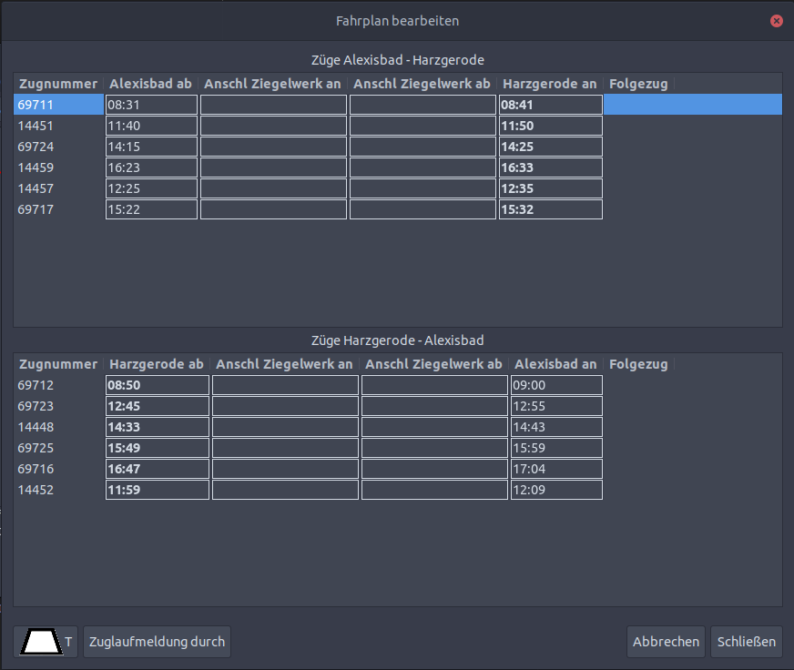
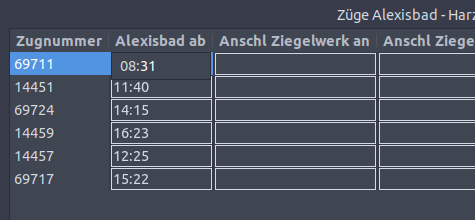

FPLedit ist seit Version 2.0.0 recht gut mit Linux kompatibel und wird auch aktiv getestet. Dabei wird auf die .NET-Laufzeitumgebung und die Gtk3-Plattform aufgebaut. Seit Version 2.2.0 ist Linux sogar das Hauptsystem auf dem FPLedit entwickelt wird!

## Abhängigkeiten installieren (.NET 5)
Für die Installation der .NET 5-Runtime auf Linux-Distributionen siehe die [ofizielle Seite von Microsoft](https://docs.microsoft.com/en-us/dotnet/core/install/linux). Eine Installation ist damit auf den meisten Linux-Distributionen (Ubuntu, Fedora, Debian, openSUSE) in einer halbwegs aktuellen Version möglich sein. Es wird auf allen Plattformen in der Regel nur das Paket `dotnet-runtime-5.0` benötigt.

Für die dynamische Bildfahrplanvorschau wird zusätzlich das Paket `libgdiplus` benötigt.


.NET 5 wird nach der Installation bei den meisten Distributionen über den Paketmanager aktuell gehalten und sollte insgesamt stabiler als das (für FPLedit bis einschließlich Version 2.3.0 verwendete) Mono-Framework sein. Andere .NET-Versionen werden daher prinzipbedingt nicht unterstützt, auch keine aktuelleren (z.B. das für 2021 angekündigte .NET 6.0). Dafür muss jeweils eine neue FPLedit-Version veröffentlicht werden.

FPLedit ab Version 2.4.0 ist **ausdrücklich nicht mehr mit Mono kompatibel**!


## Installation
Grundsätzlich reicht auch auf Linux das reine Entpacken des ZIP-Ordners. Das Programm kann mit dem Befehl `./FPLedit` im Programmverzeichnis gestartet werden.





## Andere Bedienung: Fahrplaneditoren
Unter Linux ist die Bedienung der Fahrplaneditoren (sowohl für lineare als auch für Netzwerkfahrpläne) anders als unter Windows. Felder müssen erst per Doppelklick zur Eingabe geöffnet werden. Ein einfacher Klick neben das Feld oder  schließt das Eingabefeld wieder und die Eingabe wird übernommen.

Zusätzlich stehen aber weitere Tastaturkürzel zur Verfügung:

*  wählt das erste Feld aus
*  beendet den Eingabemodus
*  wechselt ein Feld nach rechts
*  wechselt ein Feld nach links

Wenn Felder nur über die Tastatur ausgewählt werden, dann funktionieren bei der Eingabe nur die Buchstaben, Ziffern, Punktzeichen und die Löschtaste (also vor allem keine Pfeiltaste um innerhalb eines Feldes zu navigieren)!
