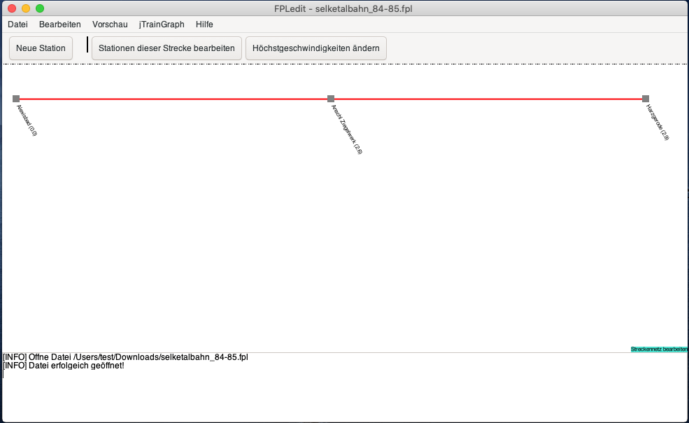

Version 2.2.2 ist erstmals auch mit macOS kompatibel. Die macOS-Untersützung ist noch rudimentär und wenig getestet. Gestestet wurde bisher nur auf macOS 10.15.

Seit FPLedit 2.4.0 steht nur noch eine native Variante mit verbesserter Kompatibilität zur Vefügung.

## Download des Paketes
Auf der Download-Seite steht ein eigenes Programmpaket bereit, das auf der Download-Seite als seperates mac-Paket angeboten wird.

## Abhängigkeiten installieren:
Es müssen keine besonderen Abhängigkeiten installiert werden, da FPLedit für macOS die .NET 5 Runtime mit paketiert. Für die dynamische Bildfahrplanvorschau wird das [Homebrew](https://brew.sh/)-Paket `mono-libgdiplus` benötigt:

```shell
brew install mono-libgdiplus
```

### Paket verwendbar machen
Um das Programmpaket verwendbar zu machen, müssen einmalig nach dem Download die folgenden Befehle im Verzeichnis des heruntergeladenen Programmpakets im Terminal ausgeführt werden:

```shell
xattr -c FPLedit.app
chmod +x FPLedit.app/Contents/MacOS/FPLedit
```

Ohne diese Befehle ist das Programm nicht nutzbar, da FPLedit nicht von Apple signiert wurde bzw. ich das Programmpaket auf meinem Linux-PC erstelle.

Anschließend kann FPLedit mit einem Doppelklick gestartet werden.


