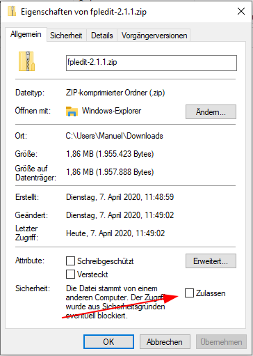

Diese Anleitung beschreibt die Installation von FPLedit auf **Windows**.

## Installation der Abhnhängigkeiten (.NET 5)
Seit FPLedit Version 2.4.0 muss die .NET 5 RUntime installiert werden: [Download .NET 5 Runtime](https://dotnet.microsoft.com/download/dotnet/current/runtime?initial-os=windows). Das alte standardmäßig installierte .NET 4.x wir nun *nicht mehr unterstützt*. Diese Installation muss nur einmalig erfolgen und sollte auch automatisch über Microsoft Update (Option „Updates für andere Maicrosoft-Produkte installieren“ in Windows Update) aktualisiert werden.

## Entpacken von FPLedit

Vor der Installation muss **unbedingt** die heruntergeladene ZIP-Datei für Windows entsperrt werden. Dazu `Rechtsklick > Eigenschaften` und dort unten den Haken bei `Zulassen` setzen (siehe Screenshot links). Anschließend kann man die ZIP-Datei an einen beliebigen Ort entpacken und die Datei `FPLedit.exe` mit einem Doppelklick starten. Dieser Ordner kann auch nachträglich noch verschoben werden.



## Dateitypzuordnung

Fahrplandateien (`.fpl`) können mit FPLedit bei Doppelklick geöffnet werden, indem sie per Rechtsmausklick auf die Datei in den `Eigenschaften` auf die Schaltfläche `Ändern` klicken und im anschließenden Dialog die ausführbare Datei von FPLedit (`FPLedit.exe` im Programmverzeichnis) auswählen.


