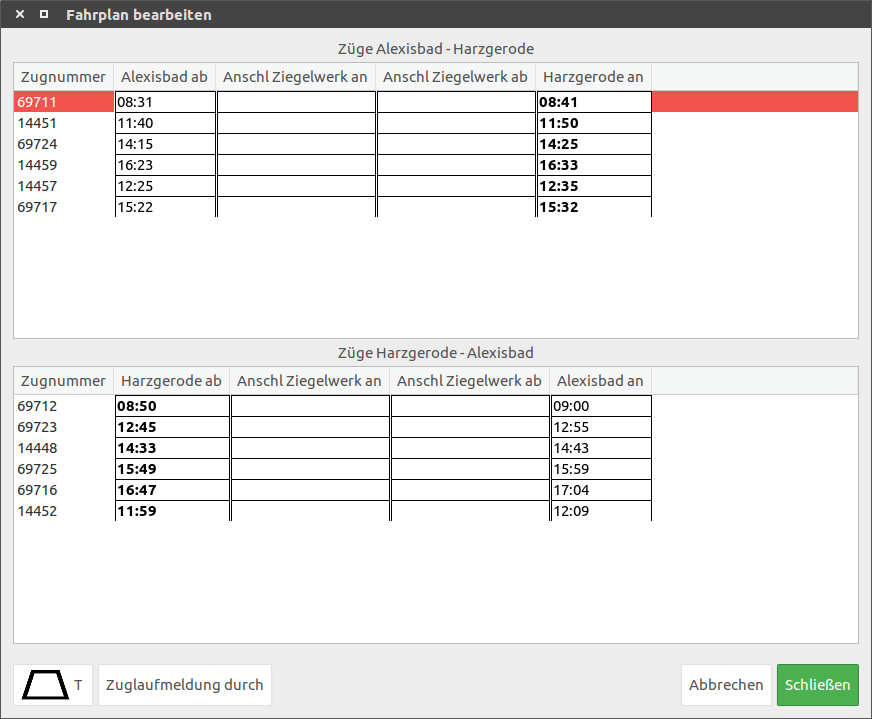
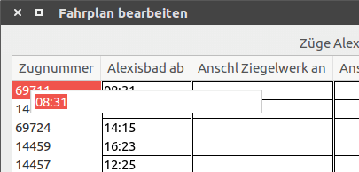
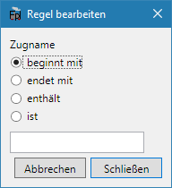
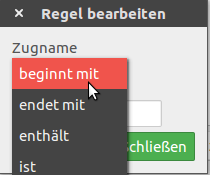

FPLedit ist seit Version 2.0.0 recht gut mit Linux kompatibel und wird auch aktiv getestet. Dabei wird auf die Mono-Laufzeit und die Gtk3-Plattform aufgebaut. Einige Funktionen sind unter Linux nicht oder nur in beschränktem Umfang verfügbar.

## Vorraussetzungen
Für die Installation der Mono-Laufzeitumgebung auf Linux-Distributionen siehe die [ofizielle Seite des Mono-Projekts](http://www.mono-project.com/download/stable/#download-lin). Wenn Mono nur für FPLedit verwendet werden soll, genügt derzeit die Installation der folgenden Pakete (unter Ubuntu):

```nohighlight
mono-runtime libmono-microsoft-csharp4.0-cil libmono-system-xml-linq4.0-cil	libmono-system-core4.0-cil libmono-security4.0-cil gtk-sharp3
```

Möglicherweise können in Zukunft weitere Abhängigkeiten hinzukommen.

## Installation
Grundsätzlich reicht auch auf Linux das reine Entpacken des ZIP-Ordners. Um Warnungen beim Start zu umgehen, kann die Datei `eto/Eto.Wpf.dll` im Programmverzeichnis gelöscht werden, da diese nur auf Windows benötigt wird. Um einen möglichst reibungslosen Betrieb von FPLedit unter Linux zu ermöglichen, ist von FPLedit Team ein Shell-Skript entwickelt worden, das hier heruntergeladen werden kann: [/fpledit.sh](/files/fpledit.sh).

Informationen zu neuen verfügbaren Versionen erhält man im Programm unter `Hilfe > Info > Auf neue Version prüfen` oder seit Version 1.2.0 durch eine Benachrichtigung beim Programmstart. Diese lässt sich ebenfalls unter `Hilfe > Info` dekativieren.

## Update auf neue Version

Zum Update auf eine neue FPLedit-Version reicht es grundsätzlich, die auf dieser Website bereitgestellte ZIP-Datei wie oben beschrieben über die alte Version neu zu entpacken. Dabei gehen aber ggf. programmweite Einstellungen verloren. Die Datei `fpledit.conf` kann aber vor dem Entpacken gesichert werden und anschließend wieder über die Version aus dem Programmpaket kopiert werden. So bleiben alle Einstellungen erhalten.


## Fahrplaneditoren
Unter Linux ist die Bedienung der Fahrplaneditoren (sowohl für lineare als auch für Netzwerkfahrpläne) anders als unter Windows. Felder müssen erst per Doppelklick zur Eingabe geöffnet werden. Ein einfacher Klick neben das Feld oder <kbd>Enter</kbd> schließt das Eingabefeld wieder und die Eingabe wird übernommen.





Zusätzlich stehen aber weitere Tastaturkürzel zur Verfügung:

* <kbd>Pos1</kbd> wählt das erste Feld aus
* <kbd>Enter</kbd> beendet den Eingabemodus
* <kbd>Tab</kbd> wechselt ein Feld nach rechts
* <kbd>Strg</kbd>+<kbd>Tab</kbd> wechselt ein Feld nach links

Wenn Felder nur über die Tastatur ausgewählt werden, dann funktionieren bei der Eingabe nur die Buchstaben, Ziffern, Punktzeichen und die Löschtaste!

## Unterschiedliche Bedienung
Unter Linux werden die auf den Windows-Screenshots zu sehenden Optionsfelder durch Drop-Down-Auswahlfelder ersetzt. Das ändert aber nichts an der Funktionalität; es ist nur etwas unübersichtlicher.

   

## Projektstatus
Trotz intensiver Tests läuft FPLedit auf Linux wahrscheinlich nicht so stabil wie auf Windows. FPLedit auf Linux kann noch sowohl kleinere als auch größere Probleme enthalten, die beim Testen unter Windows nicht auffallen. Wenn Dir ein solcher auffällt, dann melde ihn bitte an info[at]manuelhu.de!
