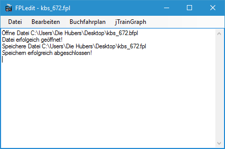
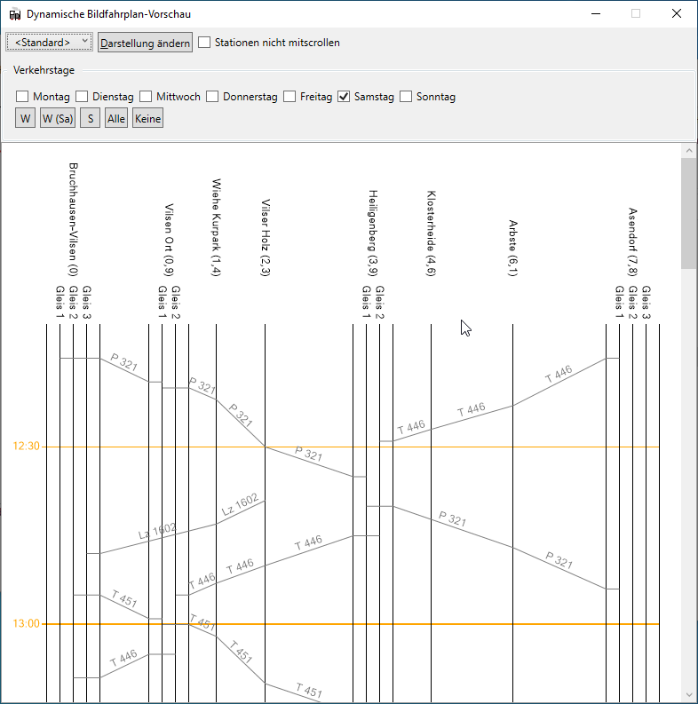
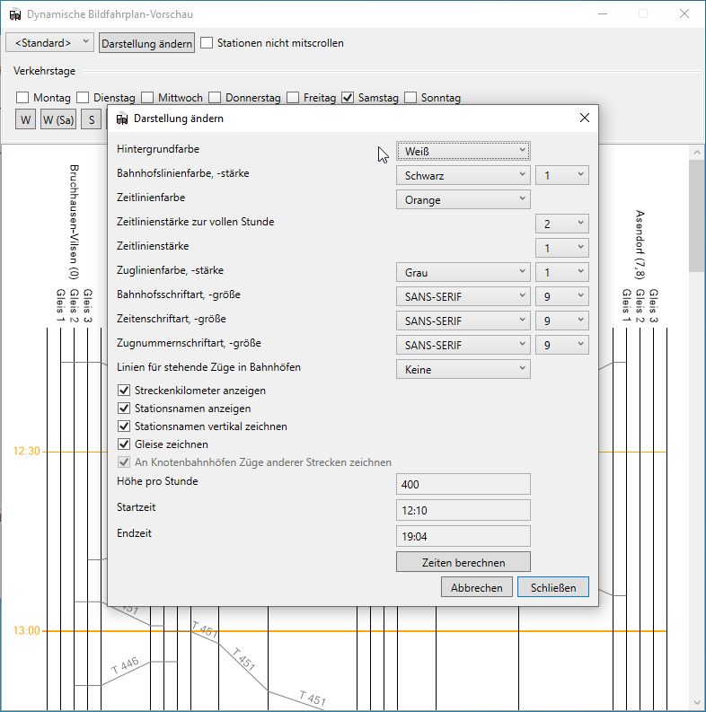

Diese Dokumentation erläutert die ersten Schritte und Grundfunktionen des Programms.

Die Arbeit mit FPLedit lässt sich grob in zwei Arbeitsschritte gliedern:

Zuerst erfolgt die Eingabe der Fahrplandaten. Dies erfolgt im Streckeneditor im Hauptfenster und größtenteils in den Dialogen des `Bearbeiten`-Menüs. Dies gliedert sich nochmals in 3 Schritte:

1. Erzeugung einer Strecke / eines Streckennetzes
2. Erzeugung von Zügen
3. Eingeben von Fahrtzeiten

Anschließend können verschiedene Ausgabeformate generiert werden, und die Ausgaben können nach eigenen Wünschen angepasst werden.

Die entsprechenden Funktionen werden in den nachfolgenden Kapiteln dieser Dokumentation erläutert.

## Hauptfenster des Programms

Nach dem Programmstart erscheint zuerst das Haptfenster. Über die verschiedenen Menüs lassen sich die Dialoge der einzelnen Funktionen aufrufen. Diese werden in den entsprechenden Kapiteln der Dokumentation näher erläutert. Im unteren Bereich des Hauptfensters werden Meldungen protokolliert, z.B. Fehler beim Öffnen oder Speichern von Dateien.

Unter dem Menü ist direkt im Hauptfenster das Strecken-Bearbeitungstool angeordnet. Hier kann auf einfache graphische Weise die Strecke oder das Streckennetz des Fahrplans bearbeitet werden. Mehr zu den verschiedenen Bearbeitungsmöglichkeiten im Kapitel zu Fahrplänen. Mit der Maus kann hier die Ansicht verschoben werden.

* Menüpunkt `Bearbeiten`: Hier gibt es die Möglichkeit, den Fahrplan nach eigenen Wünschen zu erzeugen und anzupassen. Die Reihenfolge entspricht der empfohlenen Bearbeitungsreihenfolge. Die hier befindlichen Dialoge dienen ausschließlich der Dateneingabe.
    * Der Menüpunkt `Bearbeiten > Rückgängig` können fast alle zuletzt angewendete Aktionen rückgängig gemacht werden.
    * Je nach Fahrplantyp stehen hier unterschiedliche Unterpunkte zur Verfügung.
* Menüpunkt `Vorschau`: Hier kann die Ausgabe der einzelnen Ausgabeformate geteset werden. Weitere Informationen in den jeweiligen Kapiteln.
* Menüpunkt `jTrainGraph`: Mit diesem Menüpunkt kann direkt aus FPLedit heraus [das Bildfahrplanprogramm jTrainGraph](../bildfahrplaene) gestartet werden.

## Dynamische Bildfahrplanvorschau
Mit dem Menüpunkt `Vorschau > Dynamischer Bildfahrplan` steht ein Werkzeug bereit, das bei der Fahrplangestaltung nützlich sein kann. Das Bildfahrplanfenster kann neben dem Hauptfenster dauerhaft geöffnet bleiben und zeigt immer die aktuellen Änderungen an, sobald alle anderen Dialoge geschlossen wurden. Oben links lässt sich die darzustellende Strecke auswählen.

Einige Darstellungseinstellungen lassen sich auch anpassen. Diese werden auch für den von jTrainGraph generierten Bildfahrplan übernommen. Ein Export oder Druck der dynamischen Vorschau ist nicht möglich.

<!-- TODO: virtuelle Strecken -->

## Tastenkombinationen

Einige häufig verwendete Funktionen des Hauptprogramms lassen sich über Tastenkombinationen im Hauptfenster aufrufen:

* : Datei am aktuellen Ort speichern
* : Speichern untern
* : Datei öffnen
* : Aktuelle Datei exportieren
* : Die letzte Aktion rückgängig machen
* : Versuche, den Fahrplantyp zu konvertieren
* : *(Nur lineare Fahrpläne)* Strecke bearbeiten
* : Züge bearbeiten
* : Fahrplan bearbeiten

{}
