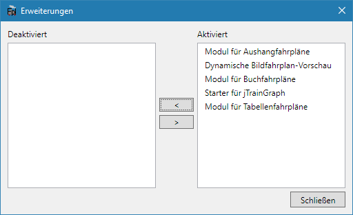

Diese Dokumentation erläutert die ersten Schritte und Grundfunktionen des Programms.

## Installation
Vor der Installation muss unbedingt die heruntergeladene ZIP-Datei für Windows entsperrt werden. Dazu `Rechtsklick > Eigenschaften` und dort unten den Haken bei `Zulassen` setzen. Anschließend kann man die ZIP-Datei an einen beliebigen Ort entpacken und die Datei `FPLedit.exe` mit einem Doppelklick starten. Dieser Ordner kann auch nachträglich noch verschoeben werden.

Zur richtigen Darstellung der Buchfahrpläne wird auch noch die systemweit zu installierende Schrift [DIN 1451 Mittelschrift alt](http://www.peter-wiegel.de/alteDin1451.html) von Peter Wiegel benötigt. Die Schriftart der Fahrpläne kann aber auch in eine andere umgeändert werden.    
Zum Generieren von Bildfahrplänen wird zusätzlich das Programm [jTrainGraph](http://kinzigtalbahn.bplaced.net/homepage/programme.html) benötigt, die Installation kann ins gleiche Verzeichnis erfolgen.

Das gleiche Verfahren wird auch bei einem Update angewandt. Informationen zur neuesten Version erhält man im Programm unter `Hilfe > Info > Auf neue Version prüfen` oder seit Version 1.2.0 durch eine Benachrichtigung beim Programmstart. Diese lässt sich ebenfalls unter `Hilfe > Info` dekativieren.

Fahrplandateien (`.fpl`) können mit FPLedit bei Doppelklick geöffnet werden, indem sie per Rechtsmausklick auf die Datei in den `Eigenschaften` auf die Schaltfläche `Ändern` klicken und im anschließenden Dialog die ausführbare Datei von FPLedit (`FPLedit.exe` im Programmverzeichnis) auswählen.

## Hauptfenster
Nach dem Programmstart erscheint zuerst das Haptfenster. Über die verschiedenen Menüs lassen sich die Dialoge der [Erweiterungen](#erweiterungen) aufrufen. Diese werden in den entsprechenden Kapiteln der Dokumentation näher erläutert. Im unteren Bereich des Hauptfensters werden Meldungen protokolliert, z.B. Fehler beim Öffnen oder Speichern von Dateien.

Unter dem Menü ist das Streckennetz-Bearbeitungstool angeordnet. Mit ihm kann das dem Fahrplan zu Grunde liegende Streckennetz erstellt und bearbeitet werden. Zum Bearbeiten des Streckennetzes siehe [Fahrpläne Bearbeiten](/fahrplaene-bearbeiten/).

Der Menüpunkt `Bearbeiten > Rückgängig` können fast alle zuletzt angewendete Aktionen rückgängig gemacht werden.

## Netzwerk- oder Linearer Fahrplan?
Im Menüpunkt `Datei > Neu` gibt es die Auswahlmöglichkeit, ob ein linearer oder ein Netzwerk-Fahrplan angelegt werden soll. Ein späteres Wechseln auf einen anderen Typ ist (zur Zeit) nicht mehr möglich. Daher stellt sich bei jedem neuen Fahrplan die Frage, welcher Typ gewählt werden soll.

* **Lineare Fahrpläne** sind für einfache Modelleisenbahnanlagen mit nur einer unverzweigten Strecke geeignet. Sie haben eine bessere Kompatibilität mit *jTrainGraph* als Netzwerk-Fahrpläne.
* **Netzwerk-Fahrpläne** sind beispielsweise für Modultreffen oder Modelleisenbahnanlagen mit einem verzweigten Streckennetz geeignet. Lineare Fahrpläne können diese Situationen nicht darstellen. De Kompatibilität mit jTrainGraph ist nicht so gut, vieles kann nur noch in FPLedit bearbeitet werden.

**Hinweis**: Alle mit einer FPLedit Version kleiner 2.0.0 oder mit jTrainGraph erstellten Fahrplandateien sind lineare Fahrpläne!

## Erweiterungen
Eines der Grundkonzepte von FPLedit ist die Erweiterbarkeit. Erweiterungen fügen Menüs und eigene Dialoge hinzu und stellen zusätzliche Funktionalität bereit. Die Erweiterungen liegen als DLL-Datei im Programmverzeichnis. Nahezu alle Programmfunktionen werden über Erweiterungen bereitgestellt. Mit dem Programm werden schon einige Erweiterungen, die standardmäßig alle aktiviert sind, mitausgeliefert:

* Aushangfahrplan-Modul (`FPLedit.Aushangfahrplan.dll`)
* Buchfahrplan-Modul (`FPLedit.Buchfahrplan.dll`)
* Importer für alte BFPL-Dateien (`FPLedit.BfplImport.dll`)
* Starter für jTrainGraph zur Bildfahrplanerstellung (`FPLedit.jTrainGraphStarter.dll`)
* Die Datei `FPLedit.Shared.dll` ist aber keine Erweiterung sondern Bestandteil des Hauptprogramms!

Erweiterungen können über über das Programm verwaltet werden (`Hilfe > Erweiterungen`). In diesem Dialog können Erweiterungen deaktiviert (`<`) oder aktiviert (`>`) werden. [Eigene Erweiterungen](/dev/) können in C# programmiert werden.

## Vorlagen
Zur Generierung der Fahrplan-Ausgabedateien kommen Vorlagen zum Einsatz. Vorlagen sind Textdateien mit der Endung `.fpltmpl`, die im vorgegebenen Format mit einem Texteditor von jedem Benutzer selbst erstellt werden können. Diese liegen im Ordner `templates/` im Programmverzeichnis.

Die Verwaltung von Vorlagen ist unter `Hilfe > Vorlagen` möglich. Fest eingebaute Vorlagen können nicht bearbeitet oder gelöscht werden, dafür können diese als bearbeitbare Kopie gespeichert werden.

## Tastenkombinationen

Einige häufig verwendete Funktionen des Hauptprogramms lassen sich über Tastenkombinationen im Hauptfenster aufrufen:

* <kbd>Strg</kbd>+<kbd>S</kbd>: Datei am aktuellen Ort speichern
* <kbd>Strg</kbd>+<kbd>O</kbd>: Datei öffnen
* <kbd>Strg</kbd>+<kbd>E</kbd>: Aktuelle Datei exportieren
* <kbd>Strg</kbd>+<kbd>Z</kbd>: Die letzte Aktion rückgängig machen

{}
