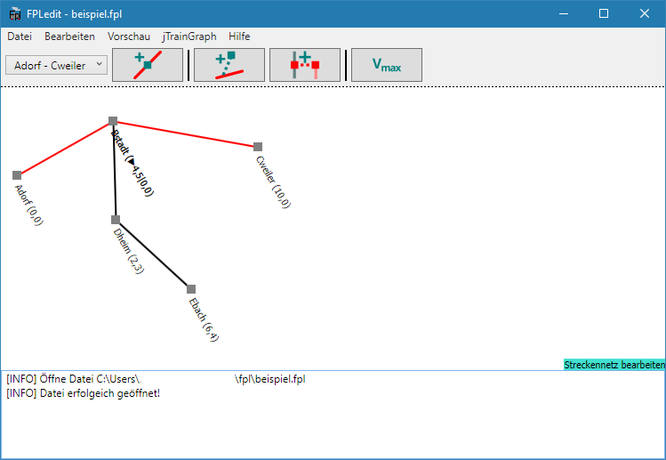

Diese Dokumentation erläutert die ersten Schritte und Grundfunktionen des Programms.

## Installation
Vor der Installation muss unbedingt die heruntergeladene ZIP-Datei für Windows entsperrt werden. Dazu `Rechtsklick > Eigenschaften` und dort unten den Haken bei `Zulassen` setzen. Anschließend kann man die ZIP-Datei an einen beliebigen Ort entpacken und die Datei `FPLedit.exe` mit einem Doppelklick starten.    
Zur richtigen Darstellung der Buchfahrpläne wird auch noch die systemweit zu installierende Schrift [DIN 1451 Mittelschrift alt](http://www.peter-wiegel.de/alteDin1451.html) von Peter Wiegel benötigt.

Das gleiche Verfahren wird auch bei einem Update angewandt. Informationen zur neuesten Version erhält man im Programm unter `Hilfe > Info > Auf neue Version prüfen`.

## Hauptfenster
Nach dem Programmstart erscheint zuerst das Haptfenster. Wenn im Menü nur der Menüpunkt `Datei` angezeigt wird, wurde die ZIP-Datei nicht wie oben beschrieben entblockt. Über die verschiedenen Menüs lassen sich die Dialoge der [Erweiterungen](#erweiterungen) aufrufen. Diese werden in den entsprecenden Kapiteln der Dokumentation näher erläutert. Im unteren Bereich des Hauptfensters werden Meldungen protokolliert, z.B. Fehler beim Öffnen oder Speichern von Dateien:

## Erweiterungen
Eines der Grundkonzepte von FPLedit ist die Erweiterbarkeit. Erweiterungen fügen Menüs und eigene Dialoge hinzu und stellen zusätzliche Funktionalität bereit. Die Erweiterungen liegen als DLL-Datei im Programmverzeichnis. Mit dem Programm werden schon einige Erweiterungen, die standardmäßig alle aktiviert sind, mitausgeliefert:

* Fahrplan-Editoren (`FPLedit.AStandard.dll`)
* Exporter für Buchfahrpläne (`FPLedit.BuchfahrplanExport.dll`)
* Importer für alte BFPL-Dateien (`FPLedit.BfplImport.dll`)
* Starter für jTrainGraph zur Bildfahrplanerstellung (`FPLedit.jTrainGraphStarter`)
* Die Datei `FPLedit.Shared.dll` ist aber keine Erweiterung sondern Bestandteil des Hauptprogramms!

Erweiterungen können über über das Programm verwaltet werden (`Hilfe > Erweiterungen`). In diesem Dialog können Erweiterungen deaktiviert (`<`) oder aktiviert (`>`) werden. Eigene Erweiterungen können in C# programmiert werden. *Dokumentation dazu folgt*

## Tastenkombinationen

Einige häufig verwendete Funktionen lassen sich über Tastenkombinationen aufrufen:

* <kbd>Strg+S</kbd>: Datei am aktuellen Ort speichern
* <kbd>Strg+O</kbd>: Datei öffnen
* <kbd>Strg+E</kbd>: Aktuelle Datei exportieren


Dieses Programm befindet sich unter aktiver Entwicklung und ist in einer Art beta-Phase. Daher können Fehler bei der Benutzung des Programms auftreten. Sie sollten daher ab und zu Sicherheitskopien der Fahrplan-Dateien anlegen, um Datenverlust vorzubeugen.

