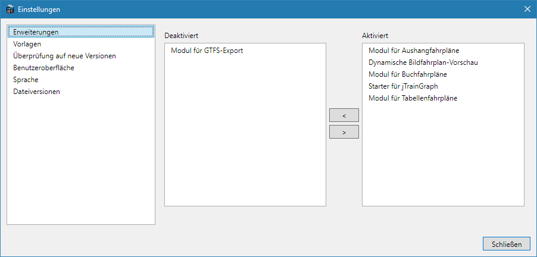

## Erweiterungen
Eines der Grundkonzepte von FPLedit ist die Erweiterbarkeit. Erweiterungen fügen Menüs und eigene Dialoge hinzu und stellen zusätzliche Funktionalität bereit. Die Erweiterungen liegen als DLL-Datei im Programmverzeichnis. Nahezu alle Programmfunktionen werden über Erweiterungen bereitgestellt. Mit dem Programm werden schon einige Erweiterungen, die standardmäßig alle aktiviert sind, mitausgeliefert:

* Aushangfahrplan-Modul (`FPLedit.Aushangfahrplan.dll`)
* Buchfahrplan-Modul (`FPLedit.Buchfahrplan.dll`)
* Modul für Tabellenfahrpläne (`FPLedit.Kursbuch.dll`)
* Starter für jTrainGraph zur Bildfahrplanerstellung (`FPLedit.jTrainGraphStarter.dll`)
* Dynamische Bildfahrplanvorschau (`FPLedit.Bildfahrplan.dll`)
* Die Datei `FPLedit.Shared.dll` ist aber keine Erweiterung sondern Bestandteil des Hauptprogramms!

Erweiterungen können über über das Programm verwaltet werden (`Hilfe > Erweiterungen`). In diesem Dialog können Erweiterungen deaktiviert (`<`) oder aktiviert (`>`) werden. [Eigene Erweiterungen](/dev/) können in C# programmiert werden.

## Vorlagen
Zur Generierung der Fahrplan-Ausgabedateien kommen Vorlagen zum Einsatz. Vorlagen sind Textdateien mit der Endung `.fpltmpl`, die im vorgegebenen Format mit einem Texteditor von jedem Benutzer selbst erstellt werden können. Diese liegen im Ordner `templates/` im Programmverzeichnis.

Die Verwaltung von Vorlagen ist unter `Hilfe > Vorlagen` möglich. Fest eingebaute Vorlagen können nicht bearbeitet oder gelöscht werden, dafür können diese als bearbeitbare Kopie gespeichert werden.

**Achtung:** Vorlagen sind ausführbarer Programmcode. Möglicherweise können Vorlagen, die nicht mit FPLedit ausgeliefert wurden und beispielsweise von einer anderen Website heruntergeladen werden, ein Sicherheitsrisiko für ihren Computer darstellen.

{}
