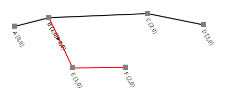
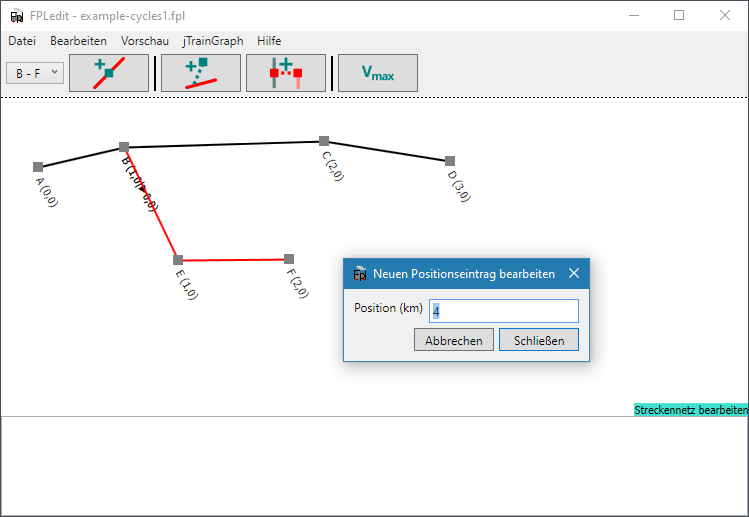
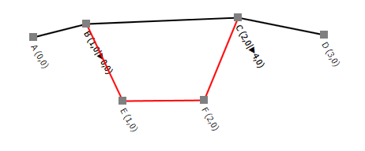
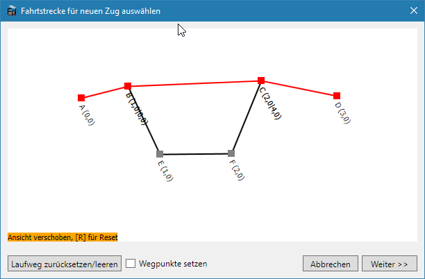
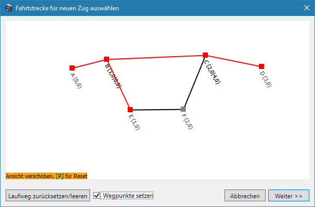
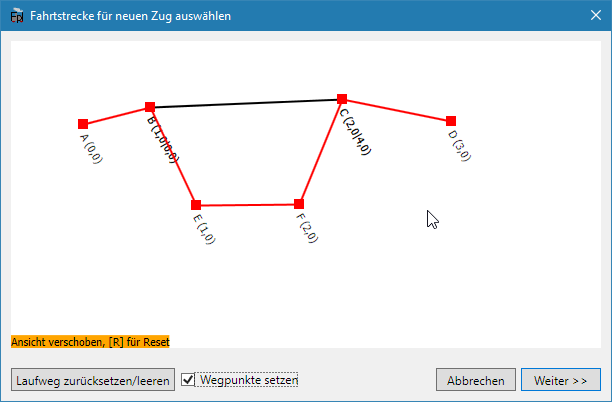

Ab FPLedit Version 2.1.0 können Netzwerke auch geschlossene Kreise enthalten. Diese Funktion ist leider nicht so bequem zu bedienen wie das Erstellen normaler Streckennetze. Deshalb ist den zyklischen Netzen hier eine eigene Seite gewidmet. Im Folgenden betrachten wir ein Beispielnetz, an dem die nötigen Konzepte erläutert werden.

## Strecken untereinander wieder verbinden

Zuerst muss eine Strecke ausgewählt werden. In diesem Beispiel die Strecke B - F. Deren offenes Ende (hier: F) soll im nächsten Schritt mit einem Bahnhof einer anderen Strecke verbunden werden. In diesem Beipiel soll eine Verbindung zwischen F und C hergestellt werden. Nach diesem Schritt werden die beiden Strecken A - B - C - D und B - E - F - C existieren.

Nach einem Klick auf `Strecken zusammenführen` erscheint muss der neue Streckenkilometereintrag für den Bahnhof C eingegeben werden:

Zum Abschluss sieht das resultierende Netz nun so aus:


Zirkuläre Strecken können nicht mehr vollständig gelöscht werden, da sonst meist mehrere Strecken zwischen zwei Stationen zusammenfallen. FPLedit wird dies verhindern, ein Löschen der letzten Station, die zwei Strecken unterscheidet ist somit nicht mehr möglich. Ein Entfernen des Streckenastes B - E - F - C ist daher in diesem Besipiel nicht mehr möglich, wohl aber das Löschen *einer* Station: E *oder* F.


## Züge in zirkulären Netzwerken anlegen

Als Beispiel soll ein Zug zwischen den Bahnhöfen A und D angelegt werden. Dabei soll der Zug über die Bahnhöfe E und F fahren. Zuerst müssen der Start- und Zielbahnhof mit einfachem Mausklick ausgewählt werden. Das Ergebnis ist ein Zug der zwar die korrekten Start- und Endbahnhöfe hat. Der Laufweg ist aber noch nicht wie gewünscht:

Um den Laufweg einfach bearbeiten zu können, muss nun unten die Option `Wegpunkte setzen` aktiviert werden. Wegpunkte können nur bei der Erstellung der Züge angelegt werden. Ihre Erstellung kann nicht rückgängig gemacht werden. Auch muss aufgepasst werden, dass die Wegpunkte **in der Reihenfolge gesetzt werden, in der der Zug sie auch durchfährt**, sonst kommt es zu fehlerhaften Ergebnissen. Da der Testzug den Laufweg A - F - E - D haben soll, wird nun der in Zugrichtung erste Wegpunkt mit einem Klick angewählt: E.

Der Laufweg des Zuges ist nun A - B - E - B - C - D und damit noch immer nicht das gewünschte Ergebnis. Deshalb wird nun F als zweiter Wegpunkt ausgewählt:

Der Laufweg ist nun vollständig und der Zug kann wie gewohnt bearbeitet werden.
