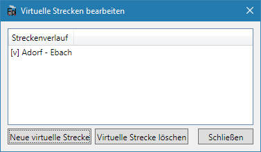

Ab FPLedit Version 2.1.0 können Netzwerke auch geschlossene Kreise enthalten. Diese Funktion ist leider nicht so bequem zu bedienen wie das Erstellen normaler Streckennetze. Deshalb ist den zyklischen Netzen hier eine eigene Seite gewidmet. Im Folgenden betrachten wir ein Beispielnetz, an dem die nötigen Konzepte erläutert werden.

## Strecken untereinander wieder verbinden

Zuerst muss eine Strecke ausgewählt werden. In diesem Beispiel die Strecke B – F. Deren offenes Ende (hier: F) soll im nächsten Schritt mit einem Bahnhof einer anderen Strecke verbunden werden. In diesem Beipiel soll eine Verbindung zwischen F und C hergestellt werden. Nach diesem Schritt werden die beiden Strecken A – B – C – D und B – E – F – C existieren.

Nach einem Klick auf `Strecken zusammenführen` muss der neue Streckenkilometereintrag für den Bahnhof C eingegeben werden:

Zum Abschluss sieht das resultierende Netz nun so aus:

## Strecken wieder trennen

Seit FPLedit 2.6.0 können Strecken auch wieder getrennt werden, solange bestimmte Bedingungen erfüllt sind: Es dürfen keine Züge über den Abschnitt verkehren. Außerdem müssen alle Stationen nach dem Trennen noch durch Strecken verbunden sein; das Trennen ist nicht möglich, wenn dass das Netz dabei in zwei seperate Teilnetze ohne Verbindung zerfallen würde.

Um eine Strecke zwischen zwei Stationen zu trennen, hier zwischen E und F, wird bei einer Station nach einem Rechtsmausklick die Option `Strecke trennen` ausgewählt:

Danach muss die zweite Station mit einem Klick ausgewählt werden, zwischen denen das Streckensegment entfernt werden soll. Diese muss direkt mit der zuerst ausgewählten Station verbunden sein, es dürfen also keine anderen Stationen dazwischen liegen:

Nach der Trennung der Strecke sieht das Netz dann so aus:

## Züge in zirkulären Netzwerken anlegen

Als Beispiel soll ein Zug zwischen den Bahnhöfen A und D angelegt werden. Dabei soll der Zug über die Bahnhöfe E und F fahren. Zuerst müssen der Start- und Zielbahnhof mit einfachem Mausklick ausgewählt werden. Das Ergebnis ist ein Zug der zwar die korrekten Start- und Endbahnhöfe hat. Der Laufweg ist aber noch nicht wie gewünscht:

Um den Laufweg einfach bearbeiten zu können, muss nun unten die Option `Wegpunkte setzen` aktiviert werden. Wegpunkte können nur bei der Erstellung der Züge angelegt werden. Ihre Erstellung kann nicht rückgängig gemacht werden. Auch muss aufgepasst werden, dass die Wegpunkte **in der Reihenfolge gesetzt werden, in der der Zug sie auch durchfährt**, sonst kommt es zu fehlerhaften Ergebnissen. Da der Testzug den Laufweg A – F – E – D haben soll, wird nun der in Zugrichtung erste Wegpunkt mit einem Klick angewählt: E.

Der Laufweg des Zuges ist nun A – B – E – B – C – D und damit noch immer nicht das gewünschte Ergebnis. Deshalb wird nun F als zweiter Wegpunkt ausgewählt:

Der Laufweg ist nun vollständig und der Zug kann wie gewohnt bearbeitet werden.

## Virtuelle Strecken

Unter `Bearbeiten > Virtuelle Strecken` lassen sich "virtuelle" Strecken abbilden – das sind Streckenverläufe, die nicht notwendigerweise mit den "echten" (über `Neue Strecke`) angelegten Streckenästen des Netzes übereinsteimmen müssen. Das ist nützlich für die Bildfahrplanvorschau, sollte man z.B. eine durchgehende Strecke gestückelt angelegt haben.

Eine virtuelle Strecke wird beim Anlegen wie ein Zug mit einem "Laufweg" versehen. Danach steht diese in der Bildfahrplanvorschau zur Verfügung, und ist mit einem `[v]` und dem angelegten Laufweg bezeichnet.

{}
