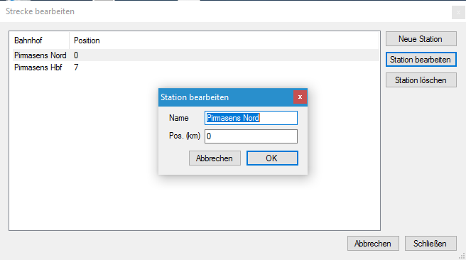
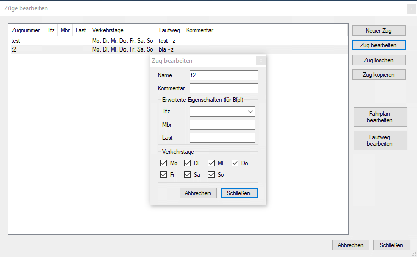
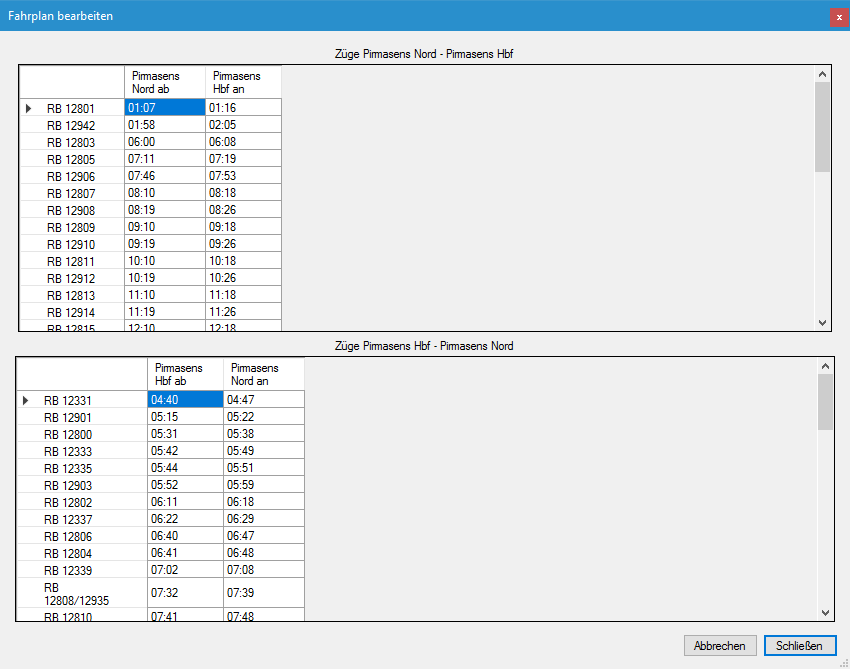

Zu den grundlegenden Funktionen von FPLedit gehört das Erstellen und Bearbeiten der Fahrpläne. Dies gliedert sich in drei Bereiche. Zuerst muss die Strecke erstellt werden, danach können Züge hinzugefügt werden und die Fahrpläne bearbeitet werden. Diese Funktionen setzen die aktivierte Standarderweiterung voraus.


Den in dieser Anleitung erstellten Fahrplan der Strecke Pirmasens Nord - Pirmasens Hbf in der Südpfalz kann man [hier](/files/kbs_672.fpl) herunterladen.


## Strecke bearbeiten

Nachdem man mit `Datei > Neu` einen neuen Fahrplan angelegt hat, kann unter dem Menüpunkt `Bearbeiten > Strecke bearbeiten` die Strecke bearbeitet werden. Die Strecke enthält alle Bahnhöfe, sie kann aber nur linear (d.h. ohne Veruweigungen oder Ringschlüsse) sein.

Durch einen Klick auf `Neue Station` kann man durch Eingabe von Bahnhofsnamen und Streckenkilometer einen neuen Bahnhof anlegen, mit `Station bearbeiten` können nachträglich die Eigenschaften einer Station wieder geändert werden. Mit dem Button `Station löschen` löscht man die selektierte Station wieder.

Mit der Schaltfläche `Strecke laden` lässt sich die Strecke aus einem anderen Fahrplan bzw. einer aus jTrainGraph exportierten Streckendatei (`.str`) laden, so lange noch keine eigenen Stationen angelegt wurden.

Nicht möglich sind Streckennetze (z.B. mit einer abzweigenden Nebenbahn) oder ringförmige Strecken. Für Netze wäre es möglich, mehrere Fahrplandateien der einzelnes Äste anzulegen.

## Züge anlegen

Wenn eine Strecke angelegt wurde, ist der Menüpunkt `Bearbeiten > Züge bearbeiten` nicht mehr ausgegraut. In diesem Fenster lassen sich die Züge, die auf der Strecke verkehren, bearbeiten.

Die Züge sind nach Fahrtrichtung geordnet, diese kann nachträglich auch nicht mehr geändert werden! Durch einen Klick auf `Neuer Zug` bei der jeweiligen Fahrtrichtung, öffnet sich ein Fenster in dem man Name, Streckenbezeichnung, Triebfahrzeug und Verkehrstage des Zuges auswählen kann. Den selben Dialog erreicht man auch mit einem Klick auf `Zug bearbeiten`, damit lassen sich dann nachträglich Züge bearbeiten. Das Triebfahrzeug lässt sich dabei aus einer Liste aller in dieser Fahrplandatei verwendeten Triebfahrzeuge auswählen.

## Fahrplan bearbeiten

Nachdem die Züge angelegt wurden, kann der Fahrplan der einzelnen Züge bearbeitet werden. Dazu öffnet man das Fenster `Bearbeiten > Fahrplan bearbeiten`. Hier können die Fahrtzeiten der Züge bearbeitet werden. Eine Zeile entspricht dabei dem Zug, dessen Name links angezigt wird. Alle Spalten (außer der ersten mit dem Zugnamen), entsprechen einer Ankunfts- bzw. Abfahrtszeit am Bahnhof, der oben in der Kopfzeile angezeigt wird.

**WICHTIG:** Die Zeitwerte *müssen* entweder im Format `hh:mm` (z.B. 06:16) oder im Format `hhmm` (z.B. 1515 für 15:15) in die Tabelle eingetragen werden. Das Programm warnt, wenn falsche Werte eingegeben wurden.


Dieses Programm befindet sich unter aktiver Entwicklung und ist in einer Art beta-Phase. Daher können Fehler bei der Benutzung des Programms auftreten. Sie sollten daher ab und zu Sicherheitskopien der Fahrplan-Dateien anlegen, um Datenverlust vorzubeugen.

