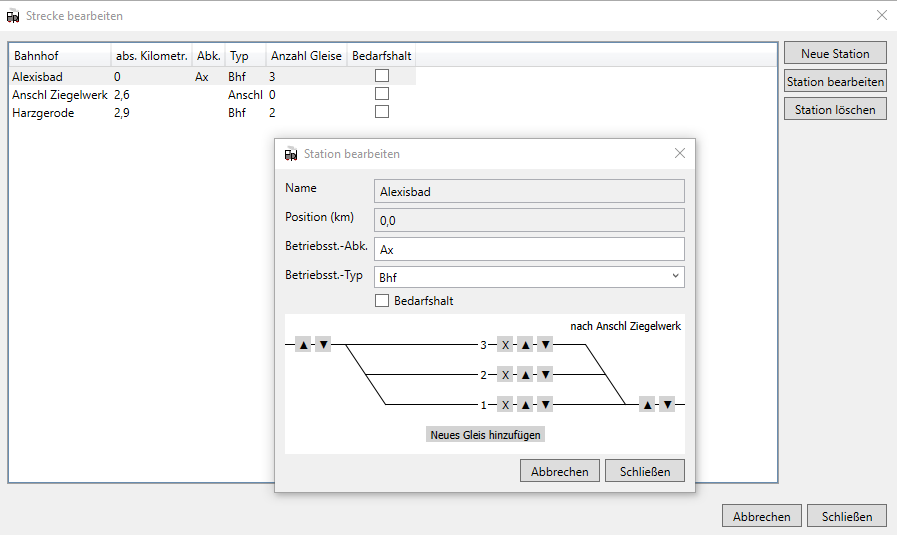
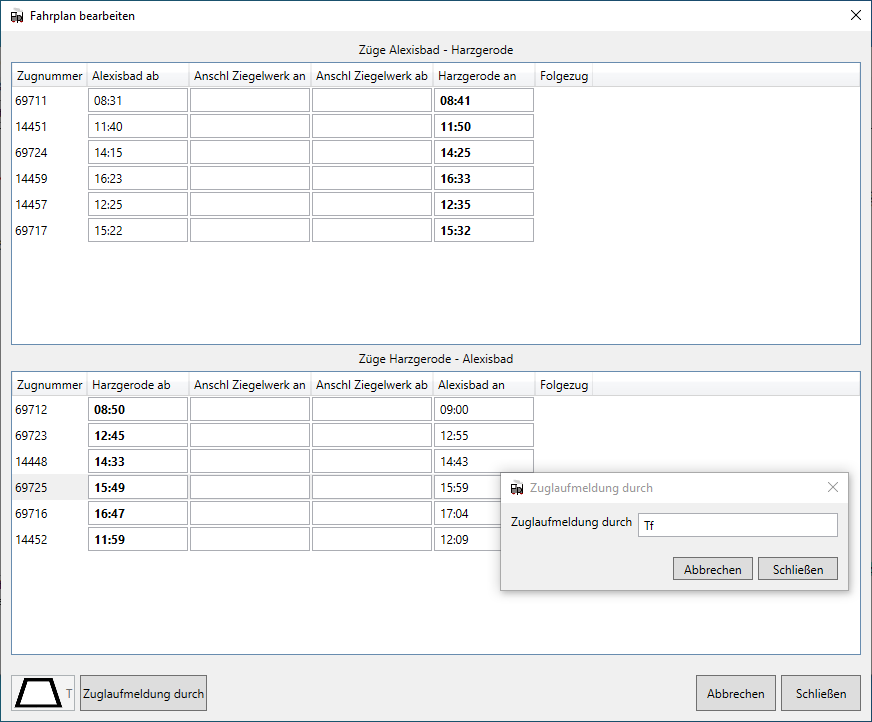

Zu den grundlegenden Funktionen von FPLedit gehört das Erstellen und Bearbeiten der Fahrpläne. Dies gliedert sich in drei Bereiche. Zuerst muss die Strecke erstellt werden, danach können Züge hinzugefügt werden und die Fahrpläne bearbeitet werden.


Den in dieser Anleitung erstellten Fahrplan der Strecke Alexisbad - Harzgerode (Jahr 1984 / 1985) kann man [hier](/files/selketalbahn_84-85.fpl) herunterladen.



Auf dieser Seite wird das Bearbeiten von linearen Fahrplänen beschrieben. Netzwerk-Fahrplänen ist eine [eigene Seite](../) gewidmet. [Zur Unterscheidung der Typen](/einfuehrung/#netzwerk-oder-linearer-fahrplan).


## Strecke bearbeiten

Nachdem man mit `Datei > Neu > Lineare Strecke` einen neuen Fahrplan angelegt hat, kann unter dem Menüpunkt `Bearbeiten > Strecke bearbeiten (tabellarisch)` die Strecke bearbeitet werden. Die Strecke enthält alle Bahnhöfe, sie kann aber nur linear sein.

Durch einen Klick auf `Neue Station` (<kbd>Strg</kbd>+<kbd>N</kbd>) kann man durch Eingabe von Bahnhofsnamen und Streckenkilometer einen neuen Bahnhof anlegen, mit `Station bearbeiten` (<kbd>Strg</kbd>+<kbd>B</kbd>) können nachträglich die Eigenschaften einer Station wieder geändert werden. Mit dem Button `Station löschen` (<kbd>Entf</kbd>) löscht man die selektierte Station wieder.

Mit der Schaltfläche `Strecke laden` (<kbd>Strg</kbd>+<kbd>L</kbd>) lässt sich die Strecke aus einem anderen Fahrplan bzw. einer aus jTrainGraph exportierten Streckendatei (`.str`) laden, so lange noch keine eigenen Stationen angelegt wurden.

## Züge anlegen

Wenn eine Strecke angelegt wurde, ist der Menüpunkt `Bearbeiten > Züge bearbeiten` nicht mehr ausgegraut. In diesem Fenster lassen sich die Züge, die auf der Strecke verkehren, bearbeiten.

Die Züge sind nach Fahrtrichtung geordnet, diese kann nachträglich auch nicht mehr geändert werden! Durch einen Klick auf `Neuer Zug` (<kbd>Strg</kbd>+<kbd>N</kbd>) bei der jeweiligen Fahrtrichtung, öffnet sich ein Fenster in dem man Name, Verkehrstage und erweiterte Eigenschaften des Zuges auswählen kann. Den selben Dialog erreicht man auch mit einem Klick auf `Zug bearbeiten` (<kbd>Strg</kbd>+<kbd>B</kbd>), damit lassen sich dann nachträglich Züge bearbeiten.

Die erweitereten Eigenschaften enthalten das Triebfahrzeug, die Mindestbremshundertstel und Last. Das Triebfahrzeug lässt sich dabei aus einer Liste aller in dieser Fahrplandatei verwendeten Triebfahrzeuge auswählen oder selbst eingeben. Diese drei Angaben sind nicht verpflichtend und werden im Buchfahrplan angzeigt.

Züge lassen sich natürlich auch mit dem entsprechenden Button bzw. mit <kbd>Entf</kbd> löschen.

Bei der Bearbeitung der Verkehrstage eines Zuges können neben den Auswahlboxen unten die folgenden Tastenkürzel verwendet werden:

* <kbd>Strg</kbd>+<kbd>A</kbd> Alle Tage anwählen
* <kbd>Strg</kbd>+<kbd>W</kbd> Verkehrt nur Werktags (Mo-Sa)
* <kbd>Strg</kbd>+<kbd>Shift</kbd>+<kbd>W</kbd> Verkehrt nur Werktags ohne Samstag
* <kbd>Strg</kbd>+<kbd>S</kbd> Verkehrt nur Sonntags
* <kbd>Strg</kbd>+<kbd>0</kbd> Keine Tage anwählen

## Fahrplan bearbeiten

Nachdem die Züge angelegt wurden, kann der Fahrplan der einzelnen Züge bearbeitet werden. Dazu öffnet man das Fenster `Bearbeiten > Fahrplan bearbeiten`. Hier können die Fahrtzeiten der Züge bearbeitet werden. Eine Zeile entspricht dabei dem Zug, dessen Name links angezeigt wird. Alle Spalten (außer der ersten mit dem Zugnamen), entsprechen einer Ankunfts- bzw. Abfahrtszeit am Bahnhof, der oben in der Kopfzeile angezeigt wird.

Für die Eingabe der Zeitwerte stehen verschiedene Formate zur Verfügung:

* `hh:mm`, z.B. `12:34` (führende Nullen können weggelassen werden und werden automatisch ergänzt, z.B. `1:34`, `11:1` oder `2:5`)
* `hhmm`, z.B. `0850` wird zu `08:50`
* `hmm`, z.B. `850` wird zu `08:50`
* `mm`, z.B. `10` wird zu `00:10`

Bei Ankünften kann festgelegt werden, ob der Zug vor der Trapeztafel halten muss. Dazu muss die entsprechende Zelle in der Tabelle ausgewählt werden und anschließend mit der Schaltfläche unten links oder mit der Taste <kbd>T</kbd> der Trapeztafelhalt aktiviert werden. Auf dem gleichen Weg wird er auch wieder deaktiviert. In der Tabelle wird der Trapeztafelhalt durch einen hellgrauen Hintergrund angezeigt. Ebenso kann festgelegt werden, wer an dem Bahnhof die Zuglaufmeldung abgibt. Dazu befindet sich ein weiterer Button unten links oder man verwendet die Taste <kbd>Z</kbd>. Dies wird durch Fettschrift symbolisiert. Eine Angabe zur Zuglaufmeldung kann auch noch bei der Abfahrt am ersten Bahnhof angegeben werden. Nicht alle Buchfahrplan-Vorlagen zeigen diese beiden Informationen an.

{}
