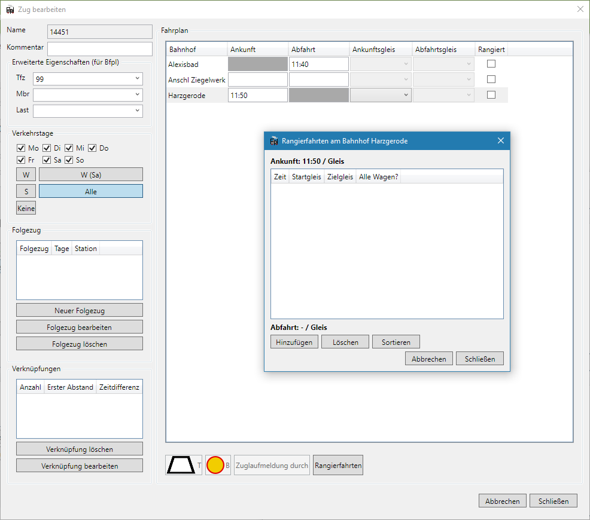
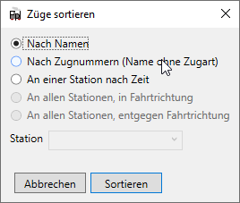

Zu den grundlegenden Funktionen von FPLedit gehört das Erstellen und Bearbeiten der Fahrpläne. Dies gliedert sich in drei Bereiche. Zuerst muss die Strecke erstellt werden, danach können Züge hinzugefügt werden und die Fahrpläne bearbeitet werden.


Den in dieser Anleitung erstellten Fahrplan der Strecke Alexisbad - Harzgerode (Jahr 1984 / 1985) kann man [hier](/files/selketalbahn_84-85.fpl) herunterladen.


## Strecke bearbeiten

Nachdem man mit `Datei > Neu > Lineare Strecke` einen neuen Fahrplan angelegt hat, kann unter dem Menüpunkt `Bearbeiten > Strecke bearbeiten (tabellarisch)` die Strecke bearbeitet werden. Die Strecke enthält alle Bahnhöfe, sie kann aber nur linear sein.

Durch einen Klick auf `Neue Station` () kann man durch Eingabe von Bahnhofsnamen und Streckenkilometer einen neuen Bahnhof anlegen, mit `Station bearbeiten` ( ) können nachträglich die Eigenschaften einer Station wieder geändert werden. Mit dem Button `Station löschen` ( ) löscht man die selektierte Station wieder.

Eine Station kann mit Gleisangaben versehen werden. Im unteren Teil des Stationseditors kann der schematische Gleisplan editiert werden. Mit einem Klick auf die entsprechenden Schlatflächen können Gleise hinzugefügt, verschoben und auch wieder entfernt werden. Mit einem Doppelklick auf den Gleisnamen kann dieser bearbeitet werden. Am Rand können die Standardgleise in die entsprechende Richtung verschoben werden.

## Züge anlegen

Wenn eine Strecke angelegt wurde, ist der Menüpunkt `Bearbeiten > Züge bearbeiten` nicht mehr ausgegraut. In diesem Fenster lassen sich die Züge, die auf der Strecke verkehren, bearbeiten.

Die Züge sind nach Fahrtrichtung geordnet, diese kann nachträglich auch nicht mehr geändert werden! Durch einen Klick auf `Neuer Zug` () bei der jeweiligen Fahrtrichtung, in dem die Daten des Zuges festgelegt werden können. Den selben Dialog erreicht man auch mit einem Klick auf `Zug bearbeiten` (), damit lassen sich dann nachträglich Züge bearbeiten. Züge lassen sich natürlich auch mit dem entsprechenden Button bzw. mit  löschen.

Im Zugfenster kann man Name, Verkehrstage und erweiterte Eigenschaften des Zuges eingeben. Die erweitereten Eigenschaften enthalten das Triebfahrzeug, die Mindestbremshundertstel und Last. Das Triebfahrzeug lässt sich dabei aus einer Liste aller in dieser Fahrplandatei verwendeten Triebfahrzeuge auswählen oder selbst eingeben. Diese drei Angaben sind nicht verpflichtend und werden im Buchfahrplan angzeigt. Unten links kann ein Folgezug ausgewählt werden. Damit können Umläufe generiert werden. Diese werden in jTrainGraph im Bildfahrplan angezeigt.

In jeder Zeile können Abfahrts- und Ankunftsgleis ausgewählt werden. Diese werden an den entsprechenden Stellen in den Fahrplänen angezeigt.

Bei der Bearbeitung der Verkehrstage eines Zuges können neben den Auswahlboxen unten die folgenden Tastenkürzel verwendet werden:

*  Alle Tage anwählen
*  Verkehrt nur Werktags (Mo-Sa)
*  Verkehrt nur Werktags ohne Samstag
*  Verkehrt nur Sonntags
*  Keine Tage anwählen

Mit einem Klick auf die Schaltfläche `Rangierfahrten` können die Rangierfahrten des aktuellen Zuges am aktuell ausgewählten Bahnhof bearbeitet werden. Dies ist nur möglich, wenn, wie oben beschrieben, Gleise angelegt wurden. Rangierfahrten bestehen dabei aus Zeitangabe, Start- und Zeilgleis. `Alle Wagen` gibt an, ob das Startgleis nach der Rangierfahrt wieder frei ist.

## Fahrplan bearbeiten

Nachdem die Züge angelegt wurden, kann der Fahrplan der einzelnen Züge bearbeitet werden. Dazu öffnet man das Fenster `Bearbeiten > Fahrplan bearbeiten`. Hier können die Fahrtzeiten der Züge bearbeitet werden. Eine Zeile entspricht dabei dem Zug, dessen Name links angezeigt wird. Alle Spalten (außer der ersten mit dem Zugnamen), entsprechen einer Ankunfts- bzw. Abfahrtszeit am Bahnhof, der oben in der Kopfzeile angezeigt wird.

Für die Eingabe der Zeitwerte stehen verschiedene Formate zur Verfügung:

* `hh:mm`, z.B. `12:34` (führende Nullen können weggelassen werden und werden automatisch ergänzt, z.B. `1:34`, `11:1` oder `2:5`)
* `hhmm`, z.B. `0850` wird zu `08:50`
* `hmm`, z.B. `850` wird zu `08:50`
* `mm`, z.B. `10` wird zu `00:10`

Bei Ankünften kann festgelegt werden, ob der Zug vor der Trapeztafel halten muss. Dazu muss die entsprechende Zelle in der Tabelle ausgewählt werden und anschließend mit der Schaltfläche unten links oder mit der Taste  der Trapeztafelhalt aktiviert werden. Auf dem gleichen Weg wird er auch wieder deaktiviert. In der Tabelle wird der Trapeztafelhalt durch einen hellgrauen Hintergrund angezeigt. Ebenso kann festgelegt werden, wer an dem Bahnhof die Zuglaufmeldung abgibt. Dazu befindet sich ein weiterer Button unten links oder man verwendet die Taste  . Dies wird durch Fettschrift symbolisiert. Eine Angabe zur Zuglaufmeldung kann auch noch bei der Abfahrt am ersten Bahnhof angegeben werden. Nicht alle Buchfahrplan-Vorlagen zeigen diese beiden Informationen an.

## Züge kopieren

Züge eines linearen Fahrplans können auch kopiert werden. Dazu reicht ein Klick auf `Zug kopieren`. Der Name des neuen Zuges muss angegeben werden. Der Zug wird um den angegeben Takt (in Minuten) verschoben. Wenn `Erweiterte Attribute übernehmen` ausgewählt ist, werden auch die Angaben zum Bildfahrplan zum Zug aus jTrainGraph mit übernommen.

## Züge sortieren

Züge können im Zugfenster sortiert werden. Dies betrifft nur die Sortierung im Zugfenster; die Fahrpläne bleiben davon unberührt. Mit einem Klick auf `Züge sortieren` kann die Sortierung durchgeführt werden. Dabei stehen verschiedene Modi zur Verfügung:

* *Nach Namen*: Die Züge werden alphabetisch nach dem Zugnamen sortiert.
* *Nach Zugnummern*: Es wird nach dem numerischen Teil des Zugnamen sortiert. Ein Zug `RB 12345` wird unter der Nummer 12345 sortiert.
* *Nach Zeit, an Station*: Die Züge werden nach der Fahrtzeit an der ausgewählten Station sortiert.
<!--* *Von oben nach unten*: Die Stationenliste der Fahrtrichtung wird von oben nach unten durchgegangen und an jedem Bahnhof sortiert.-->
<!--* *Von unten nach oben*: Die Stationenliste der Fahrtrichtung wird von unten nach oben durchgegangen und an jedem Bahnhof sortiert.-->

{}
