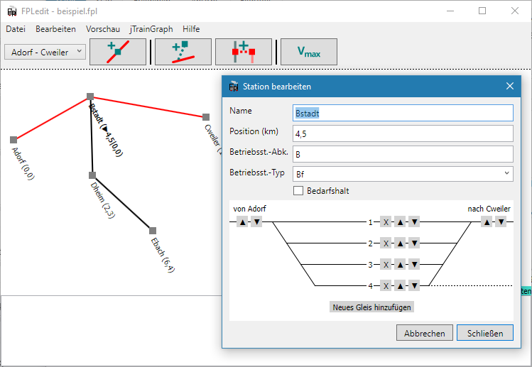
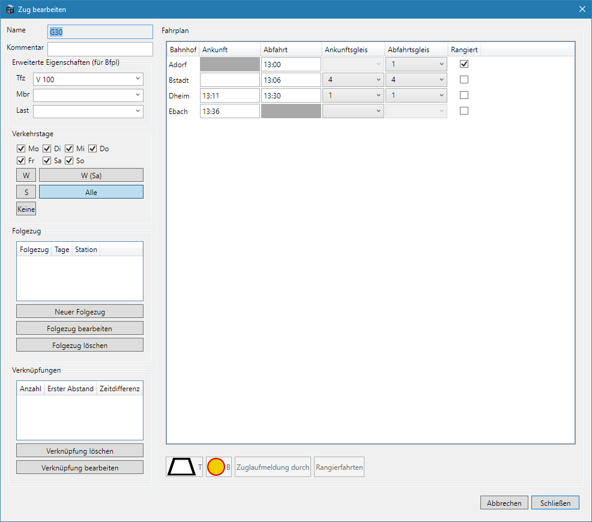
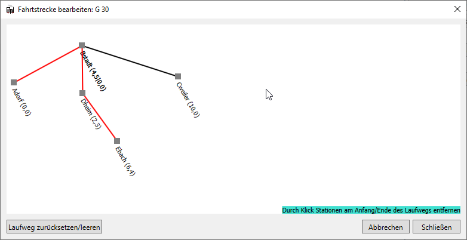

Zu den grundlegenden Funktionen von FPLedit gehört das Erstellen und Bearbeiten der Fahrpläne. Dies gliedert sich in drei Bereiche. Zuerst muss die Strecke erstellt werden, danach können Züge hinzugefügt werden und die Fahrpläne bearbeitet werden.

## Streckennetz bearbeiten

Nachdem man mit `Datei > Neu > Netzwerk-Fahrplan` einen neuen Fahrplan angelegt hat, kann unter im Hauptfenster das Streckennetz bearbeitet werden. Im Streckennetz werden die Bahnhöfe definiert. Das Streckennetz kann verzweigte Strecken enthalten.

Durch einen Klick auf `Neue Station` kann man durch Eingabe von Bahnhofsnamen und Streckenkilometer einen neuen Bahnhof anlegen, dieser wird im Netzeditor als Quadrat angezeigt. Mit einem Doppelklick auf das Quadrat können nachträglich die Eigenschaften einer Station wieder geändert werden. Mit einem Klick mit der rechten Maustaste und der Auswahl `Löschen` wird die Station wieder gelöscht. Mit gedrückter linker Maustaste können die Stationen verschoben werden, dies ändert aber nur die Darstellung im Editor und nicht die Abstände in Kilometern.

Durch einen Klick auf `Neue Strecke` wird eine neue abzweigende Seitenstrecke angelegt. Zuerst muss der Name und die Position der Station auf der neuen Strecke eingegeben werden. Anschließend kann die Station mit einem Klick beliebig im Editorfeld platziert werden. Abschließend muss noch ausgewählt werden, an welchen bereits bestehenden Bahnhof die neue Strecke angeschlossen wird, dies geschieht mit einem Klick auf das Quadrat der entsprechenden Station.

Einige Aktionen in FPLedit sind „**streckengebunden**“. Dazu zählt auch das oben beschriebene Hinzufügen einer Station. Damit diese auch auf die richtige Teilstrecke angewendet werden, muss ganz links in der Werkzeugleiste die Strecke aus dem Auswahlfeld ausgewählt werden. Zur Kontrolle wird diese im Editor rot markiert.

Eine Station kann mit Gleisangaben versehen werden. Im unteren Teil des Stationseditors kann der schematische Gleisplan editiert werden. Mit einem Klick auf die entsprechenden Schlatflächen können Gleise hinzugefügt, verschoben und auch wieder entfernt werden. Mit einem Doppelklick auf den Gleisnamen kann dieser bearbeitet werden. Am Rand können die Standardgleise in die entsprechende Richtung (abhängig von nder aktuell ausgewählten Strecke) verschoben werden.

**Hinweis**: Schon vor der Erstellung des Streckennetzes sollte man sich Gedanken zum Aufbau des Netzes machen. Strecken können nachträglich nicht mehr zusammengefügt oder getrennt werden. Aus diesem Grund sollten zusammengehörende Strecken auch immer zusammenhängend anglegt werden und nicht aus Teilstrecken zusammengestückelt werden!

Bei großen Streckennetzen kann die Verschiebe- und Zoomfunktion nützlich sein, um den Überblick zu behalten: Die Zeichenfläche kann mit der Maus verschoben werden; das Vergrößern und Verkleinern ist mit dem Mausrad oder mit den Tasten  und  möglich.

## Züge anlegen

Wenn ein Streckennetz angelegt wurde, ist der Menüpunkt `Bearbeiten > Züge bearbeiten` nicht mehr ausgegraut. In diesem Fenster lassen sich die Züge, die im Streckennetz verkehren, bearbeiten. Züge haben im Gegensatz zu früheren Versionen einen Laufweg, der für jeden Zug seperat angelegt werden kann. Daher haben Züge auch keine Richtung mehr und die entsprechenden Teilung entfällt.

Durch einen Klick auf `Neuer Zug` () öffnet sich ein Fenster, in dem der Laufweg des Zuges eingestellt werden kann. Dies geschieht durch Klicks auf die Startstation und die Endstation (in dieser Reihenfolge!), was zu einer roten Markierung des Laufweges führt, und einer anschließenden Bestätigung mit `Weiter >>`.
Anschließend öffnet sich ein Fenster in dem man Name, Verkehrstage und erweiterte Eigenschaften des Zuges auswählen kann. Den selben Dialog erreicht man auch mit einem Klick auf `Zug bearbeiten` (), damit lassen sich dann nachträglich diese Eigenschaften bearbeiten.

Die erweitereten Eigenschaften enthalten das Triebfahrzeug, die Mindestbremshundertstel und Last. Das Triebfahrzeug lässt sich dabei aus einer Liste aller in dieser Fahrplandatei verwendeten Triebfahrzeuge auswählen oder selbst eingeben. Diese drei Angaben sind nicht verpflichtend und werden im Buchfahrplan angzeigt. Unten links kann ein Folgezug ausgewählt werden. Damit können Umläufe generiert werden. Diese werden in jTrainGraph im Bildfahrplan angezeigt.

Züge lassen sich natürlich auch mit dem entsprechenden Button bzw. mit  löschen.

Bei der Bearbeitung der Verkehrstage eines Zuges können neben den Auswahlboxen unten die folgenden Tastenkürzel verwendet werden:

*  Alle Tage anwählen
*  Verkehrt nur Werktags (Mo-Sa)
*  Verkehrt nur Werktags ohne Samstag
*  Verkehrt nur Sonntags
*  Keine Tage anwählen

## Fahrplan eines Zuges bearbeiten

Nachdem die Züge angelegt wurden, kann der Fahrplan jedes einzelnen Zuges bearbeitet werden. Dazu klickt man im Zugfenster mit dem zu bearbeitenden Zug ausgewählt auf `Zug bearbeiten` (). Im sich nun öffnenden Fahrplaneditor können die Fahrtzeiten des Zuges bearbeitet werden. In der linken Spalte sind die Stationen des Laufweges angezeigt, daneben können Ankunfts- und Abfahrtszeiten bearbeitet werden.

Für die Eingabe der Zeitwerte stehen verschiedene Formate zur Verfügung:

* `hh:mm`, z.B. `12:34` (führende Nullen können weggelassen werden und werden automatisch ergänzt, z.B. `1:34`, `11:1` oder `2:5`)
* `hhmm`, z.B. `0850` wird zu `08:50`
* `hmm`, z.B. `850` wird zu `08:50`
* `mm`, z.B. `10` wird zu `00:10`

Bei Ankünften kann festgelegt werden, ob der Zug vor der Trapeztafel halten muss. Dazu muss die entsprechende Zelle in der Tabelle ausgewählt werden und anschließend mit der Schaltfläche unten links oder mit der Taste  der Trapeztafelhalt aktiviert werden. Auf dem gleichen Weg wird er auch wieder deaktiviert. In der Tabelle wird der Trapeztafelhalt durch einen hellgrauen Hintergrund angezeigt. Ebenso kann festgelegt werden, wer an dem Bahnhof die Zuglaufmeldung abgibt. Dazu befindet sich ein weiterer Button unten links oder man verwendet die Taste . Dies wird durch Fettschrift symbolisiert. Eine Angabe zur Zuglaufmeldung kann auch noch bei der Abfahrt am ersten Bahnhof angegeben werden. Nicht alle Buchfahrplan-Vorlagen zeigen diese beiden Informationen an. Ein Bedarfshalt lässt sich analog eingeben, hierzu dient die rot-umrandete gelbe Scheibe [^1] oder die Taste .

[^1]: Dies ist das Signal für Bedarfshalt bei den schwedischen Eisenbahnen. Ein Reisender kann die Scheibe von Hand in Richtung des Zuges drehen, damit der Zug anhalten wird.

In jeder Zeile können Abfahrts- und Ankunftsgleis ausgewählt werden. Diese werden an den entsprechenden Stellen in den Fahrplänen angezeigt.

Mit einem Klick auf die Schaltfläche `Rangierfahrten` können die Rangierfahrten des aktuellen Zuges am aktuell ausgewählten Bahnhof bearbeitet werden. Dies ist nur möglich, wenn, wie oben beschrieben, Gleise angelegt wurden. Rangierfahrten bestehen dabei aus Zeitangabe, Start- und Zeilgleis. `Alle Wagen` gibt an, ob das Startgleis nach der Rangierfahrt wieder frei ist.

## Laufweg eines Zuges nachträglich ändern

Natürlich lässt sich der Laufweg eines Zuges auch nachträglich bearbeiten. Dazu wird im Zugfenster `Laufweg bearbeiten` ausgewählt. Die aktuell im Laufweg enthaltenen Stationen sind rot markiert. Durch einen Klick auf eine rote Station am Rande des Laufweges wird diese aus dem Laufweg entfernt. Durch den Klick auf eine nicht markierte Station, die direkt vom Laufweganfang/-ende aus erreichbar ist wird diese zum Laufweg hinzugefügt.

Das Entfernen von Stationen aus der Mitte des Laufweges ist nicht möglich, genausowenig wie das Erstellen verzweigter Laufwege.



## Züge sortieren

Züge können im Zugfenster sortiert werden. Dies betrifft nur die Sortierung im Zugfenster; die Fahrpläne bleiben davon unberührt. Mit einem Klick auf `Züge sortieren` kann die Sortierung durchgeführt werden. Dabei stehen verschiedene Modi zur Verfügung:

* *Nach Namen*: Die Züge werden alphabetisch nach dem Zugnamen sortiert.
* *Nach Zugnummern*: Es wird nach dem numerischen Teil des Zugnamen sortiert. Ein Zug `RB 12345` wird unter der Nummer 12345 sortiert.
* *Nach Zeit, an Station*: Die Züge werden nach der Fahrtzeit an der ausgewählten Station sortiert.

{}
