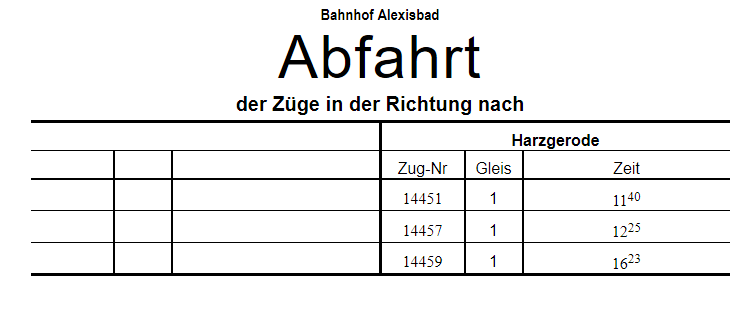

### Bildfahrpläne

Enthält alle Züge einer Strecke in graphischer Form als Weg-Zeit-Diagramm.

### Buchfahrpläne
Enthält nur einen Zug, dieser Fahrplantyp ist in der Regel für das Zugpersonal gedacht.

### Aushangfahrpläne
Enthält alle Züge, die an einem Bahnhof halten.

