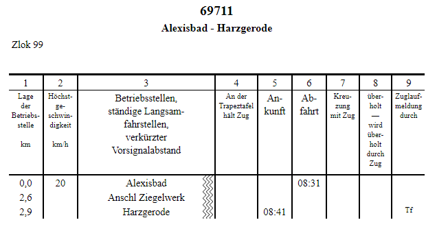

| Bildfahrpläne                                 | Buchfahrpläne                             | Aushangfahrpläne                               |
|-----------------------------------------------|-------------------------------------------|------------------------------------------------|
| Enthält alle Züge einer Strecke               | Enthält nur einen Zug                     | Enthält alle Züge, die an einem Bahnhof halten |
|                  |               |                 |
| [Erstellung mit jTrainGraph](/bildfahrplaene) | [Erstellung mit FPLedit](/buchfahrplaene) | [Erstellung mit FPLedit](/aushangfahrplaene)   |
