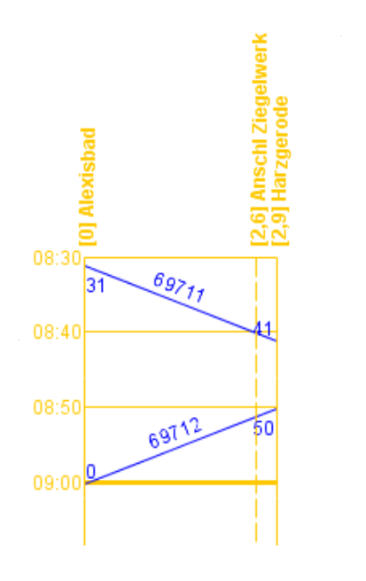

FPLedit ist ein kostenloses Programm zum Erstellen von Fahrplänen. Dies ist vorallem für **betriebsorientierte Modellbahner** interessant, die auf ihrer Anlage einen vorbildgetreun Betrieb durchführen wollen und dafür **ans Original angelehnte Fahrplanunterlagen** verwenden wollen. Die Vorlagen dafür werden in der Regel bei der DB bzw. DR gesucht. FPLedit ist dabei aber nicht so komplex (und teuer) wie andere, professionelle Fahrplansoftware für "echte" Verkehrsbetriebe.

## Features
- [Erstellen und Bearbeiten](/fahrplaene-bearbeiten/) von Fahrplänen bestehend aus einer Strecke und den darauf verkehrenden Zügen.

- Generieren von unterschiedlichen Fahrplantypen, z.B. **Buchfahrplänen** oder **Aushangfahrplänen** und anschließender Export in von FPLedit unabhängige Dateiformate (HTML).

- Kompatibilität mit dem bekannten Bildfahrplanprogramm [jTrainGraph](http://kinzigtalbahn.bplaced.net/homepage/programme.html). Dateien, die mit einer jTrainGraph-Programmversion größer oder gleich 2.02 erstellt worden sind, können mit FPLedit geöffnet werden (und anschließend auch wieder mit jTrainGraph). Das Generieren von **Bildfahrplänen** ist somit möglich.

- Weiterentwicklung: FPLedit wird weiterentwickelt und wird in Zukunft noch einige Features und andere Fahrplanformate erhalten.

- Möglichkeit der Erweiterung durch [selbst erstellte Extensions](/dev/), geschrieben in der Programmiersprache C#.

## Fahrplan-Ausgabeformate

Bei den deutschen Eisenbahnen waren und sind verschiedene Fahrplan-Formate im Einsatz. Diese Seite soll als Entscheidungshilfe dienen, welcher Fahrplantyp zum Einsatz kommen soll.

| Bildfahrpläne                                 | Buchfahrpläne                             | Aushangfahrpläne                               |
|-----------------------------------------------|-------------------------------------------|------------------------------------------------|
| Enthält alle Züge einer Strecke               | Enthält nur einen Zug                     | Enthält alle Züge, die an einem Bahnhof halten |
|                  |               |                 |
| [Erstellung mit jTrainGraph](/bildfahrplaene) | [Erstellung mit FPLedit](/buchfahrplaene) | [Erstellung mit FPLedit](/aushangfahrplaene)   |

Das Dateiformat von FPLedit und jTrainGraph ist vollständig kompatibel. Somit können alle drei Formate aus der gleichen Datei generiert werden. Ob das Anlegen der Daten mit jTrainGraph oder FPLedit erfolgt, ist dabei egal. Die erweiterte Konfiguration der Ausgabe ist aber nur mit dem entsprechenden Programm möglich.

## Systemvoraussetzungen
FPledit läuft auf allen Systemen, auf denen entweder Microsoft .NET 4.0 (vorinstalliert ab Windows Vista) oder ein aktuelles [Mono](http://www.mono-project.com/) installiert ist. Damit sollte dieses Programm auf **Windows, Linux und macOS** (ungetestet) laufen. Auf den nicht-Windows-Systemen sieht aber die Benutzeroberfläche aber leider arg gewöhnungsbedürftig aus.

## Danke!
Vielen Dank an alle, die dieses Programm verwenden: Ohne euch wäre die Arbeit hier nutzlos. Und auch ein noch größeres Dankeschön an alle die, die bei der Behebung von Fehlern und dem Testen von neuen Funktionen helfen und Ideen für neue Funktionen beisteuern! Natürlich auch ein Danke an Moritz Scherzinger von jTrainGraph für die gute Kooperation beim gemeiensamen Dateiformat!

{}
