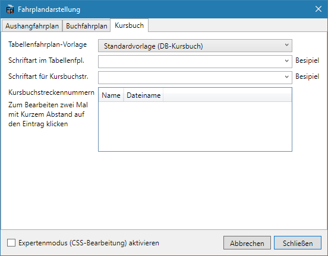

Seit Version 1.5.0 können Tabellen-/Kursbuchfahrpläne generiert werden. Die entsprechende Erweiterung muss natürlich aktiviert sein.

Um den Kursbuch/Tabellenfahrplan als Vorschau anzuzeigen, verwenden Sie `Vorschau > Kursbuch`.

Dieser Kursbuchfahrplan (generiert mit v1.5.0) ist zwar schon recht nah am Vorbild, es fehlt aber trotzdem noch einiges bzw. das Format ist stark vereinfacht:

Unter `Bearbeiten > Filterregeln` können Regeln angelegt werden, nach denen vor der Ausgabe die Züge und Bahnhöfe gefiltert werden. Damit könnten z.B. alle Güterzüge und Anschlussstellen aus dem Kursbuchfahrplan ausgeblendet werden.

## Anpassen des Tabellenfahrplans
Unter `Bearbeiten > Fahrplandarstellung` im Reiter `Kursbuch` kann das Aussehen des Tabellenfahrplans beeinflusst werden. Die Auswahlmöglichkeit einer Vorlage erlaubt es, die Darstellung des Tabellenfahrplans schnell an verschiedene Gegebenheiten anzupassen.

Die Schriftart, die für die Fahrplan-Darstellung verwendet wird, kann aus allen auf dem System installierten Schriftarten ausgewählt werden. Danaben können noch besondere Werte wie z.B. `serif`, `sans-serif` verwendet werden.

Weiterführend kann die Plandarstellung mit CSS (= Cascading Style Sheets) angepasst werden, da er ja im HTML-Format exportiert wird. Mit CSS können nahezu alle Aspekte der Plandarstellung geändert werden. Zur Aktivierung und Verwendung von CSS gibt es auf [dieser Unterseite](/dev/css/) aber eine ausführlichere Anleitung.

## Tabellenfahrpläne exportieren und drucken
Tabellenfahrpläne können mit `Datei > Export` als HTML-Datei exportiert werden. Zum Anzeigen dieser Datei wird ein Webbrowser (wie z.B. Firefox) benötigt. Zur Ansicht der HTML-Fahrpläne müssen auch die ausgewählten Schriftarten auf dem Computer installiert sein, eine einfache Weitergabe ist deshalb nicht möglich.

Ein direktes Drucken aus FPLedit heraus ist nicht möglich. Aber aus dem Webbrowser heraus können die als HTML exportierten Fahrpläne gedruckt werden.

Mit einem PDF-Drucker (wie z.B. PDF24) lassen sich so auch die exportierten Fahrpläne in eine PDF-Datei umwandeln und damit auch ohne Installation der für den Fahrplan ausgewählten Schriften auf anderen Computern ansehen.

{}
